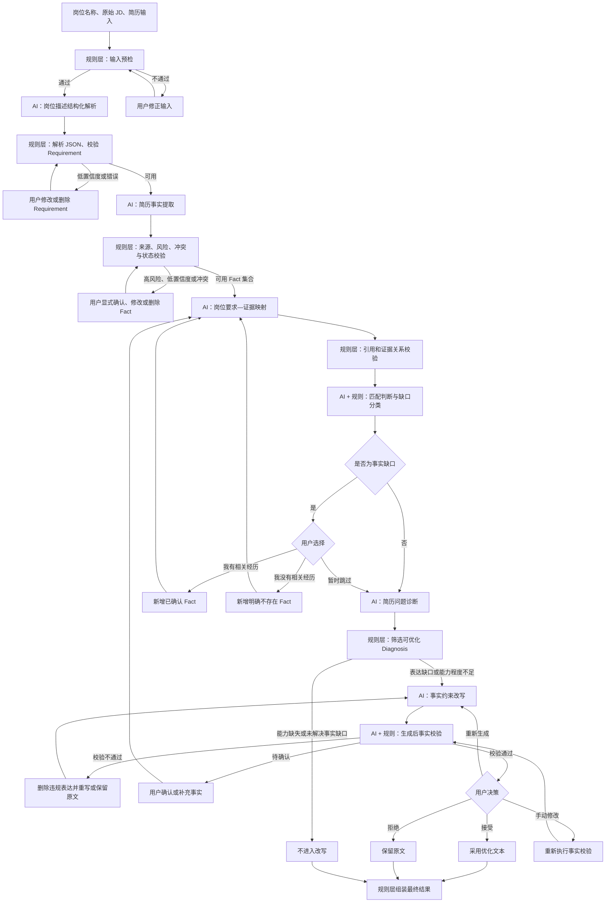
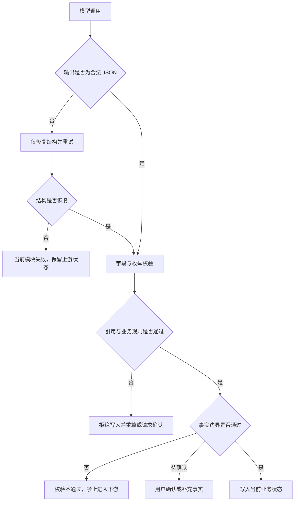

# AI 简历优化助手｜AI 方案设计

## 一、文档定位与设计范围

### 1.1 文档目的

本文基于 01～11 产品文档、现有高保真前端原型和当前领域对象，定义 MVP V1 从岗位描述到事实校验的 AI 工作流。本文只描述 AI 能力、规则约束、结构化输出、失败处理、模块依赖和 Evaluation，不重复 7 个页面的产品需求。

本文对应的完整处理链为：

`岗位描述 → 岗位要求 → 用户事实 → 岗位要求—证据映射 → 匹配状态 → 缺口分类 → 问题诊断 → 事实约束改写 → 事实校验`

### 1.2 当前实现基线

当前项目已经完成 7 页前端高保真原型和核心状态联调。模块一“岗位描述结构化解析”、模块二“简历事实提取”和模块三“岗位要求—证据映射”已通过本地 Vite 服务端代理接入真实 DeepSeek，并完成各自的结构化输出、引用与枚举校验、有限重试和错误处理。模块三只生成真实 Mapping，不生成最终 Match Status 或 Gap；模块四至七仍由 Mock 数据与确定性前端逻辑模拟。

### 1.3 方案边界

- 使用可替换的大语言模型，不在本文确定具体厂商或模型；
- 使用稳定、可观测、可回退的顺序工作流，不设计复杂 Agent 架构；
- 不引入与当前主链无直接必要关系的向量数据库或外部 RAG 基础设施；
- 不设计综合匹配评分，评分仍属于 P1；
- 不创造新的核心领域对象或第二套状态；
- 不以模型自由文本作为业务状态，所有结果必须经过结构化解析与规则校验；
- 不假设模型效果、准确率、时延、成本或线上业务结果。

### 1.4 核心安全原则

1. 无证据 ≠ 能力缺失；
2. 信息不足优先进入事实缺口并追问用户；
3. 高风险事实必须显式确认后才能用于高风险表达；
4. 不允许职责扩大、技术虚构、数字虚构和项目状态升级；
5. 不允许跨项目事实拼接成一段不存在的经历；
6. 改写结果必须返回使用的 Fact ID；
7. 生成后必须再次执行事实校验；
8. 模型只能提出候选判断，规则层负责状态合法性、权限与流程控制，用户负责事实确认和最终采用。

## 二、统一对象与状态契约

### 2.1 核心对象复用原则

AI 模块只读写当前产品已经存在的对象：

| 对象 | 用途 | 主要产生模块 |
| --- | --- | --- |
| 岗位要求（Job Requirement） | 表达原子化岗位要求及原始 JD 依据 | 岗位描述结构化解析 |
| 事实（Fact） | 表达可确认、可追溯的用户真实信息 | 简历事实提取、用户补充 |
| 证据映射（Evidence Mapping） | 连接 Requirement 与 Fact | 岗位要求—证据映射 |
| 缺口（Gap） | 解释未完整满足或需要优化的原因 | 匹配判断与缺口分类 |
| 简历诊断（Resume Diagnosis） | 定位具体简历条目的问题 | 简历问题诊断 |
| 改写建议（Rewrite Suggestion） | 保存原文、优化文本、事实依据、校验和用户决策 | 事实约束改写、生成后事实校验 |

模型不得返回与这些对象语义重复的第二套对象。调用适配层可以包含请求批次、运行日志和错误信息，但这些属于技术运行数据，不进入产品核心领域状态。

### 2.2 统一状态

| 状态类别 | 唯一允许值 |
| --- | --- |
| 匹配状态 | 满足 / 部分满足 / 未满足 / 待确认 |
| 缺口类型 | 无缺口 / 表达缺口 / 事实缺口 / 能力缺口 |
| 能力缺口子类型 | 能力缺失 / 能力程度不足 |
| 事实状态 | 已确认 / 待确认 / 明确不存在 / 信息不足 / 已删除 |
| 事实校验状态 | 校验通过 / 待确认 / 校验不通过 |

模型输出出现旧名称、近义词或未定义状态时，不直接写入业务数据。规则层只能在语义明确且映射唯一时归一化；否则将本次调用判为结构错误并重试或转人工确认。

### 2.3 标识与引用规则

- Requirement ID、Fact ID、Mapping ID、Gap ID、Diagnosis ID 和 Rewrite ID 必须稳定且唯一；
- 规则层负责生成、校验和保存稳定 ID，不能依赖模型自行维持跨调用唯一性；
- 模型输入必须携带已有对象的真实 ID；
- 模型输出中的引用 ID 必须能够在本次输入集合中解析；
- 不存在的引用、跨任务引用和已删除 Fact 引用均视为无效；
- Rewrite Suggestion 的 `usedFactIds` 必须是本次允许使用的 Fact 白名单子集。

### 2.4 置信度使用规则

- `confidence` 用于表达当前语义判断的不确定程度，不等于事实真实性或业务评分；
- 当前 Requirement 页面将低于 0.75 的解析结果显示为“建议检查”，本文沿用该现有阈值；
- Fact、Mapping 等其他模块不新增统一数值阈值，优先结合风险等级、冲突和是否需要确认处理；
- 低置信度结果不能自动转成“未满足”或“能力缺失”；
- 置信度不能替代原始来源、用户确认或事实校验。

### 2.5 AI 输出接入流程

每次 AI 调用按以下固定步骤接入业务层：

1. 组装最小必要输入和允许值；
2. 调用可替换的大语言模型；
3. 提取结构化 JSON；
4. 执行 JSON 语法解析；
5. 执行字段完整性、类型、枚举和引用校验；
6. 执行业务规则校验和事实边界校验；
7. 生成或覆盖稳定 ID；
8. 低风险且确定的结果进入候选状态，高风险或不确定结果进入用户确认；
9. 只有通过规则校验的对象才能写入当前业务状态；
10. 根据上游变化重新计算受影响的下游模块。

## 三、AI 调用链与阶段控制

### 3.1 阶段总览

| 阶段 | 主要输入 | 主要输出 | 是否调用大模型 | 规则是否可独立完成 | 是否需要用户确认 | 上游变化后是否重算下游 |
| --- | --- | --- | --- | --- | --- | --- |
| 输入预检 | 岗位名称、JD、简历文件或文本 | 可处理输入 | 否 | 是 | 用户修正无效输入 | 是，重新启动全链路 |
| 岗位描述结构化解析 | 原始 JD | Job Requirement | 是 | 只能完成格式和枚举校验 | 低置信度或用户认为错误时确认 | 是，影响 Mapping 及之后模块 |
| 简历事实提取 | 简历原文 | Fact | 是 | 只能完成来源、风险和状态约束 | 高风险、低置信度或冲突 Fact 必须确认 | 是，影响 Mapping 及之后模块 |
| 岗位要求—证据映射 | Requirement、可用 Fact | Evidence Mapping | 是 | 可完成引用过滤和候选初始化 | 用户可纠正错误 Mapping | 是，影响匹配、Gap 及之后模块 |
| 匹配判断与缺口分类 | Requirement、Mapping、Fact | 更新后的 Mapping、Gap | 是，负责语义判断 | 是，负责合法组合、权限和确定性状态转换 | 事实缺口或冲突需要用户确认 | 是，影响 Diagnosis、Rewrite 和结果 |
| 简历问题诊断 | 简历条目、Requirement、Mapping、Gap、Fact | Resume Diagnosis | 是 | 可完成过滤、优先级约束和引用校验 | 用户选择是否进入优化列表 | 是，影响 Rewrite |
| 事实约束改写 | Diagnosis、Requirement、Gap、Fact 白名单、原文 | Rewrite Suggestion | 是 | 不能用规则生成自然语言，但可控制改写权限 | 用户必须决定接受、拒绝、重生成或编辑 | 是，影响事实校验与结果 |
| 生成后事实校验 | Rewrite Suggestion、使用 Fact、原文、Requirement | 更新后的 Rewrite Suggestion | 是，负责语义核对 | 是，负责 ID、数字、状态、权限等确定性校验 | 待确认时需要；通过后仍需用户决策 | 是，影响最终结果 |

### 3.2 调用粒度

- JD 解析可按一次任务批量处理整段 JD；
- Fact 提取可按简历经历分段处理，再由规则层合并与去重；
- Evidence Mapping 和 Gap 判断以单条 Requirement 为基本业务单位，可批量调用但必须逐条返回；
- Diagnosis 以单条简历 bullet 为基本单位；
- Rewrite 和生成后事实校验必须以单条 Diagnosis / Rewrite 为单位，降低跨条目事实混用风险；
- 任一单条失败不应覆盖其他已成功对象，失败对象保持可重试或待确认状态。

### 3.3 重新计算范围

| 上游变化 | 必须失效或重新计算的下游结果 |
| --- | --- |
| JD 或 Requirement 内容变化 | 相关 Evidence Mapping、Gap、Diagnosis、Rewrite、事实校验和结果采用 |
| Requirement 删除 | 关联 Mapping、Gap、Diagnosis、优化选择和 Rewrite 不再参与当前任务 |
| Fact 内容、状态或来源变化 | 引用该 Fact 的 Mapping、Gap、Diagnosis、Rewrite 和事实校验 |
| Fact 删除 | 从 Mapping 和 Rewrite 的 Fact 引用中移除；无证据时回到事实缺口 |
| Mapping 删除或纠正 | 对应 Match Status、Gap、Diagnosis 和 Rewrite 权限 |
| Gap 变化 | Diagnosis 可优化性、优化列表和 Rewrite 权限 |
| 用户修改 Rewrite | 必须重新执行生成后事实校验；通过后才能进入最终结果 |

重新计算由规则层和工作流编排器触发，不由模型自行决定是否重跑其他模块。

## 四、模块一：岗位描述结构化解析

### 4.1 模块设计

| 项目 | 设计 |
| --- | --- |
| 模块目标 | 将非结构化 JD 拆分为可追溯、可编辑、可用于证据映射的原子化 Job Requirement。 |
| 输入 | 岗位名称、公司名称（可选）、原始 JD 文本。 |
| 输出 | `JobRequirement[]`。 |
| AI 负责什么 | 识别有效岗位要求；区分岗位职责、产品能力、AI 技术能力、专业技能、通用能力、背景要求和加分项；将复合要求拆分为原子要求；生成标准化表述、能力标签、要求强度、重要程度候选和置信度；保留原始文本依据。 |
| 规则层负责什么 | 校验必填字段和枚举；生成稳定 Requirement ID；确保 `sourceText` 能追溯到原始 JD；限制重要程度和要求强度取值；检测空结果、重复 ID、无来源要求和格式错误；将置信度低于 0.75 的条目标记为需要检查。 |
| 用户是否需要确认 | 不要求逐条强制确认；低置信度、分类错误、拆分错误或重要程度不合理时由用户修改、调整或删除；进入下一步时统一确认当前 Requirement 集合。 |
| 触发条件 | 首页输入校验通过并开始分析；用户修改原始 JD 后重新触发。 |
| 失败与低置信度处理 | JSON 解析失败时重试结构化输出；无有效 Requirement 时不进入下一步；低置信度条目保留来源并显示“建议检查”；高度模糊内容不得臆造能力要求。 |
| 与上下游关系 | 上游为任务输入；输出是 Evidence Mapping、匹配判断、Diagnosis 和 Rewrite 的岗位依据。Requirement 变化必须使相关下游结果失效或重算。 |

要求强度 `requiredLevel` 只允许以下四个枚举值：`L1 了解`、`L2 熟悉`、`L3 实践`、`L4 设计 / 主导`。其中 L1 表示了解，L2 表示熟悉，L3 表示具备实践，L4 表示能够设计或主导。模型返回近义词或格式变体时，规则层只能在不提高能力等级的前提下归一化；无法可靠归一化时使用保守等级并将置信度降至“建议检查”范围，不得导致整批 Requirement 失败。

### 4.2 结构化输出

最终写入业务层的每条对象必须保持当前 `JobRequirement` 字段：

```json
[
  {
    "requirementId": "req-001",
    "parentRequirementId": null,
    "capabilityGroupId": "cap-1",
    "sourceText": "负责 AI 产品需求分析与方案设计",
    "sourceSection": "岗位职责",
    "normalizedRequirement": "RAG 产品方案设计",
    "category": "产品能力",
    "importance": "核心要求",
    "capability": "RAG 产品方案设计",
    "keywords": [],
    "explicitRequirement": true,
    "evaluationType": "实践深度",
    "requiredLevel": "L3 实践",
    "confidence": 0.9,
    "status": "待确认"
  }
]
```

### 4.3 关键规则

- 一条 Requirement 尽量只表达一个可独立评价的能力；
- 关键词不等于 Requirement，不能只返回关键词列表；
- 公司介绍、福利和宣传文案不能被误提取为能力要求；
- `normalizedRequirement` 必须忠于 `sourceText`，不能强化原 JD 未表达的能力等级；
- `sourceText` 和 `sourceSection` 不得为空，否则无法进入后续可解释链路；
- 相同要求可以由规则层去重，但相似而评价维度不同的要求不能强行合并；
- 用户修改后的 Requirement 具有最高优先级，后续模块不得用模型原始结果覆盖。

### 4.4 当前工程实现与部署边界

- 首页调用同源 `/api/jd-analysis`，Vite 插件在服务端读取 `AI_API_URL`、`AI_API_KEY`、`AI_MODEL`、`AI_TIMEOUT_MS` 和 `AI_MAX_RETRIES`；API Key 不进入浏览器代码或回归样本；
- 当前真实模型配置使用 DeepSeek，但代理保持兼容 Chat Completions 的可替换接口；
- 服务端执行 JSON 解析、必填字段、类型、枚举、置信度、`sourceText` 原文追溯、重复 Requirement 和已知过度拆分校验，并重建稳定 ID；
- `requiredLevel` 非法格式在不提高等级的前提下归一化；无法可靠判断时使用保守结果并将置信度降至建议检查范围；category、importance 与 requiredLevel 还会经过确定性语义规则校准；
- 当前 `/api/jd-analysis` 由 Vite 的 `configureServer` / `configurePreviewServer` 提供，只适用于本地开发和 `vite preview`；正式部署需要迁移到独立后端或 Serverless。本阶段只记录该边界，不实现生产部署。

### 5.4 模块二当前工程实现与部署边界

- 首页保存的粘贴简历文本由客户端调用同源 `/api/resume-facts`；PDF 文件本轮不解析、不上传，也不阻塞 Fact 提取；
- `/api/resume-facts` 复用同一套 DeepSeek Chat Completions 配置、超时和重试环境变量，API Key 仅由服务端读取；
- 服务端生成稳定 Fact ID 和 Experience ID，校验字段、事实类型、风险等级、状态、原文来源、数字来源、项目状态、重复事实、职责等级和新增技术；高风险、冲突、低置信度和信息不足由规则层强制进入确认或信息不足状态；
- Fact 页面不再以 Mock Fact 作为首次数据来源；接口失败时展示错误和重试，不伪造或回退到 Mock Fact；用户后续确认、修改、删除和补充仍写入现有 Fact 对象与 sessionStorage；
- 当前 `/api/resume-facts` 与 `/api/jd-analysis` 一样由 Vite 的 `configureServer` / `configurePreviewServer` 提供，只适用于本地开发和 `vite preview`；正式部署需要迁移到独立后端或 Serverless。本阶段只记录边界，不实现生产部署。

## 五、模块二：简历事实提取

### 5.1 模块设计

| 项目 | 设计 |
| --- | --- |
| 模块目标 | 从简历原文中提取原子化、可确认、可追溯的用户 Fact，为匹配和改写建立事实边界。 |
| 输入 | 简历结构、经历名称、经历 ID、简历条目原文；后续也可接收用户在现有补充入口填写的真实经历。 |
| 输出 | `Fact[]`。 |
| AI 负责什么 | 识别背景、职责、行动、技术、数据、结果和项目状态等事实；按原子事实拆分；判断来源位置、风险原因、是否存在语义冲突和置信度；区分事实与修饰性表达。 |
| 规则层负责什么 | 生成稳定 Fact ID；校验来源文本和所属经历；根据高风险类别、冲突和低置信度控制 `requiresConfirmation`；限制状态值；保护数字结构；禁止 AI 自动产生“明确不存在”和“已删除”状态；过滤无来源事实。 |
| 用户是否需要确认 | 高风险事实、低置信度事实、冲突事实以及即将用于生成但原文不明确的事实必须显式确认；原文明确、低风险且无冲突的事实可进入已识别事实，但用户仍可修改或删除。 |
| 触发条件 | 简历文本或 PDF 解析文本可用时；用户修改简历输入后；用户在现有补充事实入口提交真实经历时。 |
| 失败与低置信度处理 | 无法确认的内容进入“信息不足”或“待确认”，不得自动补全；来源丢失的 Fact 不写入可用事实集合；冲突 Fact 保留冲突说明并请求用户处理。 |
| 与上下游关系 | 上游为简历输入和用户补充；输出供 Evidence Mapping、Gap、Diagnosis、Rewrite 和事实校验使用。Fact 变化需要重算所有引用该 Fact 的下游对象。 |

### 5.2 结构化输出

```json
[
  {
    "factId": "fact-002",
    "experienceId": "exp-001",
    "experienceName": "智能知识助手",
    "content": "参与用户访谈并整理需求",
    "type": "行动事实",
    "sourceText": "参与用户访谈及需求整理",
    "sourceLocation": "项目经历第 2 条",
    "riskLevel": "中",
    "riskReason": "职责边界需要确认",
    "reviewReason": "冲突事实",
    "requiresConfirmation": true,
    "confidence": 0.6,
    "status": "待确认"
  }
]
```

数字类 Fact 继续使用当前对象中的可选 `numericDetail`，仅包含 `value`、`unit` 和 `metric`。只有原文存在真实数字时才填写具体值；没有数字时字段可以省略，不允许估算或从模糊描述推导。

### 5.3 高风险事实处理

以下内容默认按高风险或需要重点审查处理：

- 主导、独立负责、负责人等职责等级；
- 用户数量、样本数量、准确率、增长率和其他量化数据；
- 商业结果、业务结果和效果提升；
- 项目是否正式上线、是否对外使用；
- 从“参与”推导出的更高职责；
- 同一事实在不同文本中存在冲突。

AI 只能提出候选 Fact，不能替用户确认高风险事实。用户明确修改或确认后，规则层更新 `status` 和 `requiresConfirmation`。

### 5.4 项目状态约束

项目状态类 Fact 只允许使用当前产品规定的选项：方案设计、原型、演示版本、最小可行产品、内部测试、正式上线。模型不得把较低阶段升级为较高阶段；无法从原文确定时进入待确认或信息不足。

## 六、模块三：岗位要求—证据映射

### 6.1 模块设计

| 项目 | 设计 |
| --- | --- |
| 模块目标 | 为每条 Requirement 找到能够证明该能力的真实 Fact，并形成可解释的 Evidence Mapping，而不是只做关键词命中。 |
| 输入 | 已确认或当前有效的 Requirement；状态可用且未删除的 Fact；Fact 所属经历和来源。 |
| 输出 | `EvidenceMapping[]`。 |
| AI 负责什么 | 判断 Requirement 与 Fact 的语义相关性；识别直接证据、部分证据和弱证据；判断证据支持程度、证据等级和原因；返回候选 Fact ID 集合和置信度。 |
| 规则层负责什么 | 过滤已删除、信息不足或不可作为正向证据的 Fact；校验所有引用 ID；生成 Mapping ID；无有效证据时初始化为无有效支持和待确认；禁止把关键词重合直接判为满足；禁止把“明确不存在”作为正向证据。 |
| 用户是否需要确认 | 不要求逐条确认；用户认为证据关系错误时可执行“该经历不能证明此要求”，只删除 Mapping 关系，不删除 Fact。 |
| 触发条件 | Requirement 和可用 Fact 已建立；Requirement 或 Fact 新增、修改、删除、确认后重新触发相关映射。 |
| 失败与低置信度处理 | 低置信度 Mapping 进入待确认，不直接判能力缺失；找不到证据时保留空 `factIds` 并交给事实缺口流程；结果引用不存在 ID 时整条 Mapping 无效。 |
| 与上下游关系 | 上游为 Requirement 和 Fact；输出供匹配判断、Gap、Diagnosis 和 Rewrite 使用。Mapping 改变后必须重算对应 Requirement 的 Match Status 与 Gap。 |

### 6.2 结构化输出

```json
[
  {
    "mappingId": "map-1",
    "requirementId": "req-001",
    "factIds": [
      "fact-001"
    ],
    "relevance": "高相关",
    "evidenceStrength": "强支持",
    "evidenceLevel": "L3 实践",
    "matchStatus": "满足",
    "reason": "存在可追溯的 RAG 方案与测试实践。",
    "confidence": 0.95
  }
]
```

模块三按现有 Evidence Mapping 对象完整返回 `matchStatus` 候选；该值不能绕过模块四直接成为最终业务状态。模块四必须结合岗位强度、证据等级、Fact 状态和 Gap 规则再次判断。当前已有 Mock 对象中的已确定状态可继续保留，不需要迁移字段。

### 6.3 证据判断规则

- 强支持：Fact 能直接证明 Requirement 的主要能力与要求强度；
- 部分支持：Fact 与 Requirement 高度相关，但职责、深度或完整性不足；
- 弱支持：只有间接关系，不能单独证明满足；
- 无有效支持：没有可用 Fact，或已有 Fact 明确表明不存在相关经历；
- 同一个 Fact 可以支持多个相关 Requirement，但每个 Mapping 必须独立解释；
- 多个 Fact 可以共同支持一个 Requirement，但不能跨项目拼接成一段不存在的单一经历；
- Evidence Mapping 判断能力证据，不评价文案是否优美。

### 6.4 无证据处理

`factIds` 为空只说明当前没有可用证据，不能直接输出“未满足”或“能力缺失”。默认进入“待确认 + 事实缺口”，由用户选择：

- 我有相关经历：补充真实 Fact 后重新映射；
- 我没有相关经历：生成按当前 Requirement 触发的“明确不存在”Fact，再转为能力缺失；
- 暂时跳过：保留待确认和事实缺口。

### 6.5 模块三当前工程实现与部署边界

- 匹配页调用同源 `/api/evidence-mapping`，输入为当前真实 Requirement 和完整 Fact Set；服务端只将“已确认、无需再次确认、无冲突”的 Fact 送入模型；
- DeepSeek 只返回 Requirement ID、Fact ID 集合、相关度、证据强度、证据等级、原因和置信度；稳定 Mapping ID 与占位 `matchStatus` 由规则层生成，最终 Match Status 和 Gap 不属于本模块；
- 服务端校验 Requirement/Fact 引用、Fact 可用状态、重复 Mapping、重复 Fact 引用、枚举、空结果、完整覆盖、跨项目叙述和证据等级上限；没有证据时保留空 `factIds`，不推断能力缺失；
- MatchingPage 以输入快照判断 Mapping 是否失效；Requirement 或 Fact 变化后重跑真实 Mapping。用户删除错误关系时只移除 Mapping 中的 Fact 引用，不删除 Fact；
- 当前 Match Status 与 Gap Type 仍来自 Mock/前端固定逻辑，并与真实 Mapping 调用隔离；`/api/evidence-mapping` 不接收也不输出 Gap；
- `/api/evidence-mapping` 与现有两个接口一样只适用于本地 Vite 开发和 `vite preview`；正式部署仍需迁移到独立后端或 Serverless。

## 七、模块四：匹配判断与缺口分类

### 7.1 模块设计

| 项目 | 设计 |
| --- | --- |
| 模块目标 | 在证据映射基础上判断每项岗位要求满足到什么程度，并解释缺口性质与后续改写权限。 |
| 输入 | Job Requirement、Evidence Mapping、被引用 Fact、Requirement 的要求强度和重要程度。 |
| 输出 | 更新后的 `EvidenceMapping.matchStatus` 与对应 `Gap`。 |
| AI 负责什么 | 比较要求强度与证据等级；判断证据能否证明满足、部分满足或需要确认；提出 Gap 类型、能力缺口子类型、原因和下一步操作候选。 |
| 规则层负责什么 | 校验 Match Status 与 Gap Type 合法组合；执行“无证据不等于能力缺失”；根据用户补充或明确不存在执行确定性状态转换；设置改写权限；保证能力缺失不可改写；保证事实缺口优先追问。 |
| 用户是否需要确认 | 满足或部分满足通常不强制确认，但允许纠错 Mapping；事实缺口需要用户补充、明确不存在或跳过；能力缺失必须来自用户明确确认或等价的可靠事实，不得由模型仅凭缺证据推断。 |
| 触发条件 | Evidence Mapping 已生成或发生变化；Fact 状态、Requirement 强度或 Mapping 关系变化。 |
| 失败与低置信度处理 | 低置信度保持“待确认 + 事实缺口”；Match Status 与 Gap 冲突时拒绝写入并重算；无法区分表达问题和能力不足时优先保留待确认。 |
| 与上下游关系 | 上游为 Requirement、Fact 和 Mapping；输出直接决定 Diagnosis 类型、优化列表资格、Rewrite 权限和结果页剩余问题。 |

### 7.2 Evidence Mapping 输出示例

```json
{
  "mappingId": "map-2",
  "requirementId": "req-002",
  "factIds": [
    "fact-002"
  ],
  "relevance": "高相关",
  "evidenceStrength": "部分支持",
  "evidenceLevel": "L2 参与",
  "matchStatus": "部分满足",
  "reason": "能够证明参与用户访谈，但不足以证明独立负责用户研究。",
  "confidence": 0.88
}
```

### 7.3 Gap 输出示例

```json
{
  "gapId": "gap-2",
  "requirementId": "req-002",
  "gapType": "能力缺口",
  "capabilityGapSubtype": "能力程度不足",
  "reason": "证据只能证明参与访谈，不能证明独立负责。",
  "severity": "中",
  "rewritePermission": "可直接改写",
  "nextAction": "只优化真实参与经历，不提升职责等级。"
}
```

### 7.4 合法状态组合

| 匹配状态 | Gap | 解释 | 改写权限 |
| --- | --- | --- | --- |
| 满足 | 无缺口 | 证据充分且当前表达无需优先处理 | 无需改写 |
| 满足 | 表达缺口 | 真实能力满足，但简历呈现不足 | 可直接改写 |
| 部分满足 | 能力缺口—能力程度不足 | 有相关实践，但证据不足以证明要求等级 | 有限改写，不能升级能力 |
| 待确认 | 事实缺口 | 当前信息不足，不能判断是否具备能力 | 先追问或补充 |
| 未满足 | 能力缺口—能力缺失 | 用户明确确认没有相关真实经历 | 不可改写 |

现有数据中如存在其他“满足 + 无缺口”或同类稳定组合可以继续使用，但规则层不得接受“待确认 + 能力缺失”或“未满足 + 事实缺口”等语义冲突组合。

### 7.5 用户分支后的确定性更新

**我有相关经历**：规则层新增状态为“已确认”的 Fact，将 Mapping 更新为强支持和满足，并将 Gap 更新为表达缺口。真实产品接入 AI 后可以重新评估证据强度，但在用户补充信息未通过来源和字段校验前不得写入满足。

**我没有相关经历**：规则层新增与当前 Requirement 绑定语义的“明确不存在”Fact，将 Mapping 更新为无有效支持和未满足，将 Gap 更新为能力缺口—能力缺失。

**暂时跳过**：不更改 Fact、Mapping 和 Gap，继续保持待确认 + 事实缺口。

## 八、模块五：简历问题诊断

### 8.1 模块设计

| 项目 | 设计 |
| --- | --- |
| 模块目标 | 以具体简历条目为单位说明问题、岗位关系、事实依据、优先级和安全修改方向。 |
| 输入 | 原始简历条目、所属经历、相关 Requirement、Evidence Mapping、Gap 和 Fact。 |
| 输出 | `ResumeDiagnosis[]`。 |
| AI 负责什么 | 识别表达过于泛化、用户问题不清、本人职责不清、关键行动缺失、已有真实证据未体现、相关性较弱、缺少真实结果、事实风险和信息冗余等问题；生成问题说明和修改方向。 |
| 规则层负责什么 | 生成 Diagnosis ID；校验简历条目、Requirement 和 Fact 引用；保证 `gapType` 与当前 Gap 一致；按 Requirement 重要程度、Gap 严重程度和可优化性约束优先级；过滤已删除 Requirement；禁止能力缺失进入优化列表。 |
| 用户是否需要确认 | 用户不需要确认每条诊断结论，但决定是否加入优化列表；事实缺口需要先返回匹配页补充；用户可以不选择任何建议。 |
| 触发条件 | 当前 Requirement、Mapping 和 Gap 已形成；上游 Requirement、Fact、Mapping 或 Gap 变化后重新生成受影响诊断。 |
| 失败与低置信度处理 | 诊断无法明确定位到简历条目时不输出；缺少 Requirement 或 Mapping 引用时丢弃该候选；AI 判断与当前 Gap 冲突时以当前 Gap 为准并重新诊断。 |
| 与上下游关系 | 上游为匹配和缺口结果；输出决定优化列表和 Rewrite 输入。Diagnosis 不得自行改变 Match Status 或 Gap。 |

### 8.2 结构化输出

```json
[
  {
    "diagnosisId": "diag-002",
    "resumeItemId": "item-exp-001-1",
    "experienceId": "exp-001",
    "experienceName": "智能知识助手",
    "originalText": "参与用户访谈及需求整理",
    "issueType": "本人职责不清",
    "description": "能够证明参与过访谈，但当前信息不足以证明独立负责用户研究。",
    "requirementIds": [
      "req-002"
    ],
    "primaryRequirementId": "req-002",
    "factIds": [
      "fact-002"
    ],
    "gapType": "能力缺口",
    "priority": "高",
    "suggestion": "强化真实参与动作，但保留“参与”的职责边界。"
  }
]
```

### 8.3 诊断与 Gap 的操作关系

| Gap | 诊断应强调 | 是否可以进入改写 |
| --- | --- | --- |
| 表达缺口 | 已有事实未充分体现、行动或机制不清 | 可以 |
| 能力缺口—能力程度不足 | 当前证据只能证明较低参与程度 | 可以，但只能优化真实表达 |
| 能力缺口—能力缺失 | 当前没有相关真实经历 | 不可以 |
| 事实缺口 | 需要补充行动、职责、方法或真实结果 | 不可以，先补充 Fact |
| 无缺口 | 通常不列为优先问题 | 默认不进入 |

### 8.4 优先级原则

优先级由规则层综合已有字段确定，不由模型自由扩大：

- 核心 Requirement 对应、能够安全优化且影响表达判断的问题优先；
- 高风险事实问题优先提示，但未确认前不能直接生成；
- 能力缺失可以是高优先级问题，但不能因此获得改写权限；
- 加分项缺失不能被自动判断为高优先级核心问题；
- 优先级与 Gap 类型分离，不能用“高优先级”替代真实性边界。

## 九、模块六：事实约束改写

### 9.1 模块设计

| 项目 | 设计 |
| --- | --- |
| 模块目标 | 在 Requirement、Diagnosis、Gap 和已确认 Fact 白名单约束下，对单条简历内容生成可解释、可追溯的优化版本。 |
| 输入 | 单条 Resume Diagnosis、原始文本、相关 Requirement、当前 Gap、当前 Mapping、同一经历内可用 Fact 白名单。 |
| 输出 | `RewriteSuggestion`。 |
| AI 负责什么 | 优化措辞、调整信息顺序、突出岗位相关真实行动、压缩冗余、生成清晰且专业的单条候选文本，并返回修改原因和实际使用的 Fact ID。 |
| 规则层负责什么 | 判断当前 Gap 是否允许改写；构造只包含可用 Fact 的白名单；过滤已删除或不属于允许范围的 Fact；生成 Rewrite ID；校验 `usedFactIds`；禁止能力缺失和未处理事实缺口调用改写；控制用户决策状态。 |
| 用户是否需要确认 | 必须。AI 结果默认“待处理”，用户需要接受、拒绝、重新生成或手动修改；AI 不自动覆盖原文。 |
| 触发条件 | 用户在诊断页选择表达缺口或能力程度不足的可优化条目。 |
| 失败与低置信度处理 | 信息不足时停止生成并返回上游事实补充；生成失败时保留原文并允许重试；多次失败后不伪造成功结果，用户可保留原文或手动修改。 |
| 与上下游关系 | 上游为 Diagnosis、Gap、Mapping 和 Fact；输出必须进入生成后事实校验，只有校验通过且被用户接受或编辑的文本才能进入最终结果。 |

### 9.2 结构化输出

```json
{
  "rewriteId": "rewrite-001",
  "diagnosisId": "diag-001",
  "originalText": "负责 AI 简历优化助手产品设计",
  "optimizedText": "负责 AI 简历优化助手产品设计，围绕求职者定位简历问题的场景，设计需求梳理、证据映射与核心流程原型，完成演示版本方案。",
  "requirementIds": [
    "req-005"
  ],
  "usedFactIds": [
    "fact-008"
  ],
  "reason": "补充已确认的用户问题、核心机制和真实职责。",
  "validationStatus": "待确认",
  "userDecision": "待处理"
}
```

生成模块本身不能把 `validationStatus` 设为“校验通过”。生成完成后的安全初始状态为“待确认”，必须由模块七校验后更新。

### 9.3 Fact 白名单

允许进入单条改写的 Fact 必须同时满足：

- 状态为已确认，或符合当前产品定义的原文明确、低风险且无冲突的可用事实；
- 未被用户删除；
- 与当前 Diagnosis 和 Requirement 有有效 Mapping，或属于当前原始简历条目所在经历的必要上下文；
- 来源可追溯；
- 高风险信息已经显式确认；
- 不属于“明确不存在”或“信息不足”。

模型必须从白名单中选择并返回 `usedFactIds`。返回空数组时，规则层不得允许生成包含新增事实的表达；返回白名单之外的 ID 时，本次生成直接进入校验不通过。

### 9.4 允许与禁止的改写

**允许：**

- 优化措辞和句式；
- 调整真实信息顺序；
- 强化与岗位相关的已有行动；
- 合并重复表达；
- 删除与目标岗位关系较弱的冗余；
- 使用已经确认的真实数字和结果；
- 对能力程度不足优化参与过程，但保留原职责等级。

**禁止：**

- 将参与、协助、配合改写为主导、独立负责或负责人；
- 添加未确认的技术、工具或方法；
- 添加、估算或改写不存在的数字和业务结果；
- 将方案设计、原型、演示版本、最小可行产品或内部测试升级为正式上线；
- 将 JD 中的技术直接复制到简历而无 Fact 支持；
- 把不同经历、不同项目的 Fact 拼接成一个不存在的项目故事；
- 把能力程度不足包装为完全满足；
- 为能力缺失生成虚假经历。

### 9.5 重新生成与手动修改

- 重新生成可以改变措辞、顺序和表达重点，不能改变 Requirement、Fact 白名单和能力等级；
- 每次重新生成都产生新的候选优化文本，但继续使用当前 Rewrite Suggestion 对象承载最终候选状态；
- 用户手动修改后必须重新执行模块七，不能直接跳过事实校验；
- 用户拒绝后保留原文，不需要继续调用模型；
- 用户接受的前提是 `validationStatus` 为“校验通过”。

## 十、模块七：生成后事实校验

### 10.1 模块设计

| 项目 | 设计 |
| --- | --- |
| 模块目标 | 在优化文本进入最终结果前，再次检查每个声明是否能够由已允许 Fact 支持，并阻止新增或升级事实。 |
| 输入 | Rewrite Suggestion、原始文本、`usedFactIds` 对应 Fact、相关 Requirement、当前 Gap 和同一经历边界。 |
| 输出 | 更新 `validationStatus` 后的 `RewriteSuggestion`。 |
| AI 负责什么 | 对比原文、优化文本和 Fact 语义；识别职责升级、技术新增、数字新增、结果夸大、项目状态升级、跨项目拼接和无法由 Fact 支持的新声明。 |
| 规则层负责什么 | 校验 `usedFactIds` 是否存在且属于白名单；检查明确数字、项目状态词和禁用状态；禁止校验不通过的建议被接受；决定是否重试、回到事实补充或保留原文；控制最终采用。 |
| 用户是否需要确认 | “校验通过”后仍由用户决定是否接受；语义存在歧义或高风险信息来源不足时设为“待确认”，要求用户确认；“校验不通过”不能接受。 |
| 触发条件 | 每次 AI 生成、重新生成或用户手动修改之后。 |
| 失败与低置信度处理 | 校验模块自身失败时保持“待确认”，不能默认通过；发现新增事实时设为“校验不通过”；多次校验或重写失败后保留原文。 |
| 与上下游关系 | 上游为 Rewrite、Fact、Requirement 和 Gap；输出决定用户是否可接受及结果页是否采用优化文本。 |

### 10.2 结构化输出

模块七不新增校验对象，直接返回当前 `RewriteSuggestion` 的完整结构并更新 `validationStatus`：

```json
{
  "rewriteId": "rewrite-001",
  "diagnosisId": "diag-001",
  "originalText": "负责 AI 简历优化助手产品设计",
  "optimizedText": "负责 AI 简历优化助手产品设计，围绕求职者定位简历问题的场景，设计需求梳理、证据映射与核心流程原型，完成演示版本方案。",
  "requirementIds": [
    "req-005"
  ],
  "usedFactIds": [
    "fact-008"
  ],
  "reason": "补充已确认的用户问题、核心机制和真实职责。",
  "validationStatus": "校验通过",
  "userDecision": "待处理"
}
```

现有对象没有独立的“校验问题列表”字段，因此 MVP V1 不新增持久化字段。校验失败的技术原因可以写入运行日志，前端只根据状态和已有事实边界显示可操作反馈。

### 10.3 校验顺序

1. 校验 Rewrite、Diagnosis、Requirement 和 Fact 引用是否存在；
2. 校验 `usedFactIds` 是否全部位于本次白名单；
3. 检查优化文本中的职责声明是否高于 Fact；
4. 检查技术、工具和方法是否在 Fact 中存在；
5. 检查数字、单位、指标和结果是否有完全对应的真实来源；
6. 检查项目状态是否被升级；
7. 检查是否混入其他项目 Fact；
8. 检查能力程度不足是否被表述成独立负责或完全匹配；
9. 由可替换的大语言模型执行语义一致性复核；
10. 规则层综合结果写入事实校验状态。

### 10.4 校验状态判定

| 状态 | 判定 | 后续动作 |
| --- | --- | --- |
| 校验通过 | 所有关键声明均能由允许 Fact 支持，且未发现升级或跨项目拼接 | 允许用户接受、拒绝、重生成或编辑 |
| 待确认 | 存在语义歧义、高风险来源不充分或校验模块未完成可靠判断 | 请求用户确认或补充，不进入最终结果 |
| 校验不通过 | 出现白名单外事实、职责扩大、技术虚构、数字虚构、状态升级或跨项目事实拼接 | 禁止接受；删除违规表达后重写或保留原文 |

### 10.5 结果采用规则

- 已采纳 + 校验通过：结果页使用 `optimizedText`；
- 已编辑 + 校验通过：结果页使用用户最终编辑的 `optimizedText`；
- 已拒绝：结果页使用 `originalText`；
- 待处理、待确认或校验不通过：结果页使用 `originalText`；
- 事实校验状态不能被用户决策覆盖；用户点击接受也不能使校验失败内容进入结果。

## 十一、AI 与规则层边界

### 11.1 AI 负责的能力

- 理解非结构化 JD 和简历文本；
- 识别候选 Requirement 和 Fact；
- 判断 Requirement 与 Fact 的语义相关性；
- 比较要求强度和证据能力等级；
- 提出 Match Status、Gap 和 Diagnosis 候选；
- 在事实白名单内生成自然语言优化文本；
- 识别生成文本与事实之间的语义冲突。

AI 输出永远是候选结果，不直接拥有页面跳转、数据删除、最终状态写入或结果采用权限。

### 11.2 规则层负责的能力

- 输入完整性、文件类型和流程条件；
- 所有状态枚举和合法组合；
- 稳定 ID、对象引用和任务隔离；
- Fact 风险与显式确认权限；
- 已删除、明确不存在和信息不足 Fact 的使用限制；
- Match Status 与 Gap Type 分离；
- 表达缺口、事实缺口和能力缺口对应的改写权限；
- 用户分支后的确定性状态转换；
- 生成前 Fact 白名单；
- 生成后 ID、数字、项目状态和权限校验；
- 下游失效与重新计算；
- 用户决策和结果采用；
- 失败重试、降级和保留原文。

### 11.3 用户负责的决策

- 纠正 Requirement；
- 确认、修改、删除和补充 Fact；
- 明确有相关经历、没有相关经历或暂时跳过；
- 删除错误 Evidence Mapping；
- 选择优化条目；
- 接受、拒绝、重新生成或手动修改；
- 对最终投递文本进行确认。

### 11.4 不采用复杂 Agent 的原因

当前任务链步骤固定、状态明确、可枚举规则多，且简历是高事实敏感场景。顺序工作流更便于：

- 控制每个模块的输入与输出；
- 定位格式错误和事实错误；
- 对单条 Requirement、Fact 或 Rewrite 重试；
- 执行规则校验和用户确认；
- 记录可追溯的中间对象；
- 避免模型自由规划导致绕过事实边界。

因此 MVP V1 使用工作流编排器依次调用模块，不让模型自主决定下一步工具或页面。

## 十二、结构化输出与调用规范

### 12.1 输入最小化

每个模块只接收完成当前任务所需的数据：

- JD 解析不需要完整简历；
- Fact 提取不需要模型预先看到全部岗位要求才能提取原始事实；
- Mapping 只接收当前 Requirement 与候选 Fact；
- Rewrite 只接收当前条目、相关 Requirement、Diagnosis、Gap 和 Fact 白名单；
- 事实校验只接收当前 Rewrite 及其允许使用的事实。

最小化输入可以降低跨项目混用、无关信息干扰和意外新增事实的风险。

### 12.2 JSON 解析顺序

1. 拒绝 Markdown 解释段，只提取预期 JSON；
2. 校验 JSON 是否可解析；
3. 校验顶层是预期对象或数组；
4. 校验必填字段存在且类型正确；
5. 校验枚举值；
6. 校验置信度取值可用；
7. 校验引用 ID；
8. 校验字段间业务关系；
9. 校验来源与事实边界；
10. 通过后再写入业务状态。

### 12.3 不允许模型控制的字段

以下内容即使出现在模型输出中，也必须由规则层最终决定：

- 稳定 ID；
- 用户确认结果；
- `status` 的已确认、明确不存在和已删除状态；
- `requiresConfirmation` 的最终值；
- 改写权限；
- 用户决策（userDecision）；
- 事实校验最终放行；
- 页面进度与跳转；
- 最终结果采用。

### 12.4 可观测性要求

每次调用应能够追踪：

- 所属任务和模块；
- 使用的对象 ID；
- 结构解析是否成功；
- 枚举与引用校验是否成功；
- 是否触发重试、降级或用户确认；
- 哪些下游对象被标记为需要重算。

运行日志不写入新的产品领域字段，也不能记录超出调试所需的用户敏感原文。

## 十三、异常处理与降级

### 13.1 模型输出格式错误

- 检测到非 JSON、多余解释文本、错误顶层结构或字段缺失时，不写入业务状态；
- 首先使用同一输入请求模型仅修复结构，不允许改变事实内容；
- 修复后仍不符合结构时，按该模块失败处理；
- 已成功对象保留，失败对象单独重试，避免整批覆盖。

### 13.2 JSON 解析失败

- 保存技术错误类型，不保存不完整对象；
- 重新发起严格结构化输出；
- 多次失败后展示可重试状态，保留上一步已确认数据；
- 不能用正则拼接或默认值伪造一个看似成功的业务对象。

### 13.3 低置信度

- Requirement 低于当前 0.75 阈值时显示“建议检查”；
- Fact、Mapping 和 Gap 低置信度时进入待确认或信息不足，不自动判为未满足；
- 低置信度结果必须保留原始来源和判断理由；
- 用户修改或确认后的结果优先于模型原始置信度。

### 13.4 信息不足

- 无法从简历确定事实时输出“信息不足”Fact 或“待确认 + 事实缺口”；
- 事实缺口优先追问用户，不直接生成文本；
- 用户可以补充真实经历、明确没有经历或暂时跳过；
- 暂时跳过允许继续，但后续诊断和结果必须提示可能不完整。

### 13.5 结果冲突

结果冲突包括：

- 同一 Fact 在不同来源中职责或数字不一致；
- Mapping 认为强支持，但 Match Status 为未满足；
- Gap 为能力缺失，但 Fact 中存在相关已确认经历；
- Diagnosis 的 Gap 与当前 Gap 对象不一致；
- Rewrite 使用已删除或白名单外 Fact。

规则层发现冲突后不选择任一模型结果强行覆盖，而是使冲突对象失效，保留可追溯来源，并将高风险事实交给用户确认或重新计算上游。

### 13.6 模型新增事实

出现以下任一情况即视为模型新增或升级事实：

- 优化文本包含 `usedFactIds` 无法支持的新职责；
- 出现 Fact 白名单之外的技术或工具；
- 出现原文和 Fact 中没有的数字、用户量、准确率、增长率或结果；
- 项目状态被升级；
- 不同经历的 Fact 被合并成单一项目叙述；
- 能力程度不足被表达成主导或独立负责。

处理方式：事实校验状态设为“校验不通过”，禁止接受；可以删除违规内容后重新生成。系统不能把新增内容反向写入 Fact 来使其“合法化”。

### 13.7 多次生成失败

- 保留原文和已确认 Fact，不覆盖用户内容；
- 停止自动连续生成，避免无界重试；
- 用户可以稍后重试、手动修改或拒绝建议；
- 如果失败来自事实不足，返回事实补充流程；
- 如果失败来自结构或服务异常，保留当前业务状态并提供重试；
- 不把失败包装为校验通过，也不生成默认虚构文案。

### 13.8 AI 服务不可用

- 页面保留用户输入和已完成步骤状态；
- 不删除已确认 Requirement、Fact 或用户决策；
- 当前模块显示失败并允许重试；
- 能由规则完成的状态恢复、已有数据展示和返回上一步继续可用；
- 没有 AI 结果时不跳过必要模块伪造后续结论。

## 十四、模块依赖关系

### 14.1 依赖表

| 模块 | 强依赖 | 可独立重跑 | 变化后影响 |
| --- | --- | --- | --- |
| 岗位描述结构化解析 | 原始 JD | 是 | Mapping、匹配、Gap、Diagnosis、Rewrite、校验 |
| 简历事实提取 | 简历原文和经历边界 | 是，可按经历重跑 | Mapping、匹配、Gap、Diagnosis、Rewrite、校验 |
| 岗位要求—证据映射 | Requirement、可用 Fact | 是，可按 Requirement 重跑 | Match Status、Gap、Diagnosis、Rewrite、校验 |
| 匹配判断与缺口分类 | Requirement、Mapping、Fact | 是，可按 Requirement 重跑 | Diagnosis、优化资格、Rewrite、结果 |
| 简历问题诊断 | 简历条目、Requirement、Mapping、Gap、Fact | 是，可按条目重跑 | 优化列表、Rewrite |
| 事实约束改写 | Diagnosis、Requirement、Gap、Fact 白名单 | 是，只重跑当前条目 | 当前 Rewrite 与校验 |
| 生成后事实校验 | Rewrite、Fact、Requirement、Gap | 是，只重跑当前 Rewrite | 用户接受权限和最终结果 |

### 14.2 依赖原则

- 下游对象必须引用当前版本的上游对象；
- 用户修改上游后，旧下游结果不能继续显示为有效结论；
- 重新计算尽量限制在受影响的 Requirement、Fact 或简历条目，不必无条件重跑整份任务；
- 任何下游模型都不能修正上游事实，只能提出需要回到上游确认；
- 最终结果是原始简历、有效 Rewrite、事实校验和用户决策的确定性组合，不需要额外生成模型。

## 十五、AI 调用总流程图

### 15.1 正常流程与关键分支



### 15.2 失败恢复流程



## 十六、Demo 开发进度与后续顺序

### 16.1 第一阶段：结构化输出底座（模块一、模块二范围已完成）

1. 建立可替换的大语言模型调用适配层；
2. 建立统一 JSON 提取、解析、枚举校验和 ID 引用校验；
3. 建立单模块失败、重试、降级和运行日志；
4. 模块一真实 AI 失败时明确报错并保留输入，不把 Mock 当成真实分析结果；测试使用无密钥的固定夹具和假模型隔离验证。

### 16.2 第二阶段：岗位描述结构化解析（已完成）

1. 接入真实 JD 文本；
2. 输出当前 Job Requirement 对象；
3. 接入低置信度检查、用户编辑和删除；
4. 验证 Requirement 修改、删除、重要程度调整、查看原文、确认继续和刷新恢复。

### 16.3 第三阶段：简历事实提取与确认（已完成，PDF 除外）

1. 以粘贴简历文本为本阶段输入；
2. 按经历拆分 Fact 并保留来源；
3. 接入风险驱动确认、数字保护、职责等级保护、技术来源保护和项目状态保护；
4. Fact 页面使用真实提取结果，失败时不回退 Mock；
5. PDF 文本解析留待后续，不改变 Fact 对象。

### 16.4 第四阶段：Evidence Mapping 与 Gap

1. 以单条 Requirement 为单位建立 Mapping；
2. 接入引用过滤和无证据安全状态；
3. 接入 Match Status 与 Gap 合法组合；
4. 跑通“有经历、无经历、暂时跳过”和 Mapping 纠错后的重算。

### 16.5 第五阶段：Diagnosis

1. 以简历条目为单位生成问题说明；
2. 确保与当前 Mapping 和 Gap 一致；
3. 接入优先级规则和优化列表权限；
4. 验证能力缺失和事实缺口不会进入 Rewrite。

### 16.6 第六阶段：Rewrite 与事实校验

1. 构建单条 Fact 白名单；
2. 生成 Rewrite Suggestion 并返回 `usedFactIds`；
3. 接入生成后事实校验；
4. 接受、拒绝、重新生成和手动修改均走同一状态与校验链；
5. 结果页继续使用现有确定性组装规则。

### 16.7 第七阶段：全链路回归

1. 从首页真实输入完成完整 7 页流程；
2. 验证上游修改触发局部重算；
3. 验证刷新与返回不丢失已确认状态；
4. 验证异常调用不污染已有数据；
5. 验证结果统计与实际决策一致。

## 十七、Evaluation 重点

### 17.1 Evaluation 原则

- 不在没有测试结果前宣称模型效果；
- 每个模块单独评估，再做端到端评估；
- 同时评估结构正确性、语义质量、事实安全和流程稳定性；
- 使用人工标注的 JD、简历、Requirement、Fact、Mapping、Gap、Diagnosis 和 Rewrite 作为对照；
- 高风险红线错误优先于语言流畅度；
- 重复运行应检查基本一致性，但不要求自然语言完全相同。

### 17.2 岗位描述结构化解析

重点验证：

- Requirement 提取是否完整；
- 原子化拆分是否正确；
- 分类与重要程度是否合理；
- 标准化表述是否忠于原文；
- `sourceText` 是否可追溯；
- 是否错误提取公司宣传或福利；
- 低置信度提示是否能够覆盖模糊要求。

当前已建立匿名化 AI 产品经理完整 JD 回归夹具，人工基准为约 19 条 Requirement，并通过 `npm.cmd run test:jd` 固定验证正常完整 JD、加分语义、短 JD、过度拆分、分类、重要程度、四级 requiredLevel、重复项、原文追溯、非法枚举归一化、空结果和 JSON 错误。该命令不调用真实模型、不读取 API Key；真实模型效果仍需按人工基准定期抽样复核，不能由确定性规则测试替代。

### 17.3 简历事实提取

当前已建立 `npm.cmd run test:fact`，固定验证正常项目经历、参与/负责/主导等级、数字事实、技术事实、项目状态、信息不足、高风险事实、原文追溯、重复 Fact、非法枚举、空结果和 JSON 错误。该命令不调用真实模型、不读取 API Key；真实 DeepSeek 联调仍受外部服务可达性影响。

### 17.3 简历事实提取

重点验证：

- 事实是否来自原文；
- 原子化拆分是否合理；
- 职责、技术、数字、结果和项目状态是否正确识别；
- 高风险 Fact 是否进入显式确认；
- 是否出现原文没有的 Fact；
- 来源位置和所属经历是否正确；
- 冲突和信息不足是否被保留，而不是被强行补全。

### 17.4 Evidence Mapping

重点验证：

- Fact 与 Requirement 的相关性是否正确；
- 强支持、部分支持、弱支持和无有效支持是否合理；
- 是否因关键词重合产生错误强映射；
- 是否引用已删除或不可用 Fact；
- 无证据时是否安全进入待确认，而不是能力缺失；
- 用户删除 Mapping 后是否正确保留 Fact。

### 17.5 匹配判断与缺口分类

重点验证：

- 四种 Match Status 是否使用一致；
- Match Status 与 Gap Type 是否分离；
- 表达缺口、事实缺口、能力程度不足和能力缺失是否区分正确；
- 事实缺口是否优先追问；
- 用户补充或明确不存在后状态转换是否正确；
- 能力程度不足是否被误判为完全满足；
- 加分项缺失是否被过度放大。

### 17.6 简历问题诊断

重点验证：

- 是否定位到具体简历条目；
- 问题说明是否与 Requirement、Mapping 和 Gap 一致；
- 修改方向是否可执行且不诱导虚构；
- 优先级是否合理；
- 能力缺失和事实缺口是否被错误加入优化列表；
- 同一输入的诊断是否具有基本稳定性。

### 17.7 事实约束改写

重点验证：

- 是否只使用白名单 Fact；
- `usedFactIds` 是否完整、真实、可解析；
- 是否发生职责扩大；
- 是否新增技术、数字、结果或项目状态；
- 是否跨项目拼接；
- 能力程度不足是否保留真实边界；
- 表达是否更具体、相关、简洁和可读；
- 用户拒绝或接受的结果是否正确进入结果页。

### 17.8 生成后事实校验

重点验证：

- 能否发现职责升级、技术新增、数字虚构、结果夸大和状态升级；
- 能否发现白名单外 Fact 和跨项目拼接；
- 校验失败是否真正阻止接受和结果采用；
- 校验模块失败时是否保持待确认，而不是默认通过；
- 用户手动修改后是否再次校验；
- 误报是否会无谓阻断真实、安全的改写。

### 17.9 端到端红线测试

至少覆盖以下红线：

1. 简历只有“参与”，生成结果不得出现“主导”或“独立负责”；
2. JD 要求 Agent，但用户没有相关 Fact，不得生成 Agent 项目经历；
3. 原文没有数字，不得生成百分比、用户量或业务增长；
4. 演示版本不得改写为正式上线；
5. 两个项目的事实不得拼成一个项目成果；
6. 无 Evidence 不得直接判能力缺失；
7. 校验不通过的 Rewrite 不得进入最终结果；
8. 用户拒绝后结果页必须保留原文；
9. 用户手动修改后必须使用最终编辑文本，且需重新校验；
10. 上游 Fact 或 Requirement 修改后，不得继续使用已失效的旧下游结论。

### 17.10 暂不设定的指标

本文不编造准确率、召回率、通过率、接受率、模型时延、成本或用户效果目标。具体基线、测试集规模、验收阈值和线上监控指标应在真实 Demo 接入后，根据人工标注样本和实际运行结果确定。

## 十八、文档与当前代码差异及待确认项

### 18.1 已识别差异

1. 模块一、模块二和模块三已接入真实 DeepSeek；模块四至七仍使用 Mock 数据或确定性前端逻辑。
2. 当前真实 JD、Requirement、粘贴简历文本、Fact 与 Evidence Mapping 已贯通；最终 Match Status、Gap、Diagnosis 和 Rewrite 仍读取 Mock 数据或前端固定逻辑。
3. 当前“重新生成”通过前端固定文案变化模拟，没有真实调用模型；目标方案要求每次重新生成继续遵守同一 Fact 白名单并重新校验。
4. 当前用户手动修改后直接标记为“已编辑 + 校验通过”；现有机制文档和本文要求手动修改后再次执行事实校验。真实 AI 接入时应修正此差异。
5. 当前 Requirement 或 Fact 内容、状态发生变化后，会使旧 Mapping 输入快照失效并重新调用真实 Evidence Mapping；最终 Match Status 与 Gap 的语义重算仍待模块四实现。
6. 当前 PDF 选择没有真实解析、独立 MIME 校验和文件大小阻断；Fact 模块本轮只处理粘贴简历文本，不改变本文 Fact 对象设计。
7. 当前 `JobRequirement`、`Fact` 等 TypeScript 字段多为普通字符串类型；模块一已经在服务端和客户端执行运行时校验，后续模块仍需各自补齐枚举与引用校验。
8. 当前 `/api/jd-analysis`、`/api/resume-facts` 和 `/api/evidence-mapping` 依赖 Vite 开发或 Preview 服务，尚未迁移到独立后端或 Serverless，不属于生产部署实现。

### 18.2 不阻塞当前方案的未定义项

以下技术参数在现有产品文档中没有最终定义，本文不擅自确定：

- 模块二及后续使用的具体大语言模型厂商与型号；
- 生产环境的并发和成本预算；模块一超时和最大重试次数已支持环境变量配置；
- Fact、Mapping、Gap 的统一数值置信度阈值；
- 真实 PDF 解析服务；
- Evaluation 测试集规模和各项验收阈值；
- 生产日志保留时间与敏感数据脱敏策略。

这些参数不影响 7 个 AI 模块、对象契约和业务边界，可以在 Demo 技术选型和 Evaluation 准备阶段确认。

### 18.3 当前无需新增的产品定义

当前 01～11 文档与代码已经足以确定 AI 工作流的产品边界，不需要新增页面、状态、领域对象、评分、Agent、向量数据库或 RAG 系统。后续实现需要确认的是工程参数和评估阈值，而不是重新定义产品逻辑。
