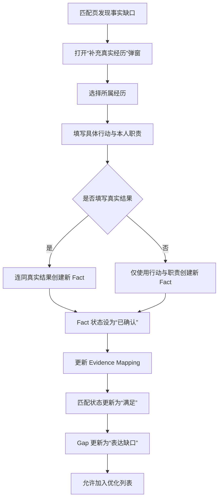
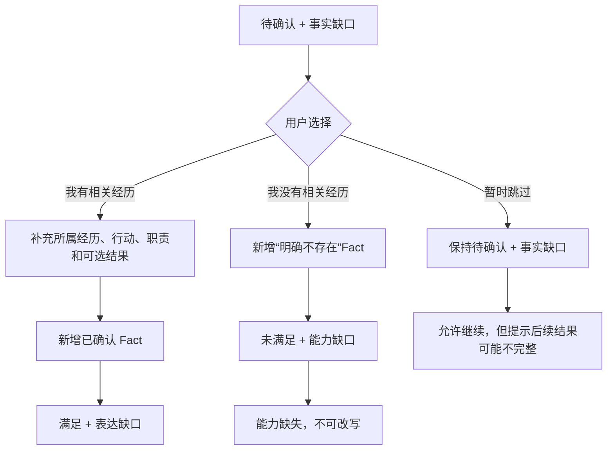
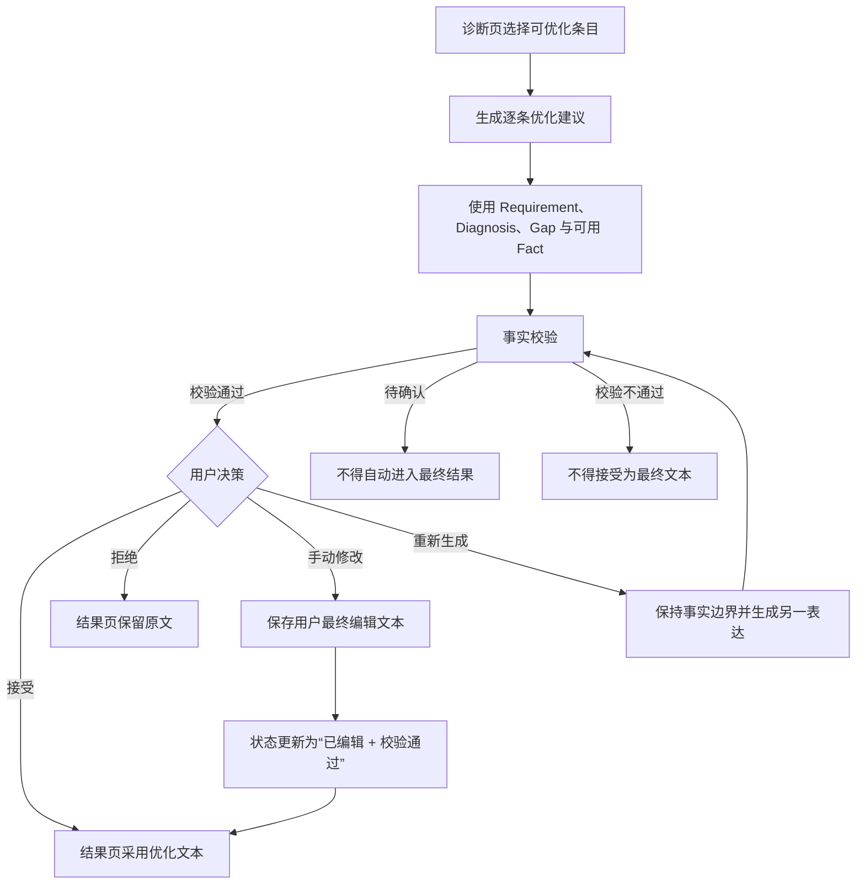
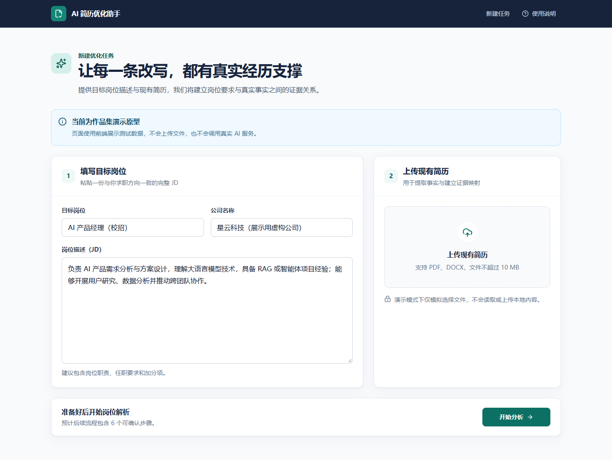
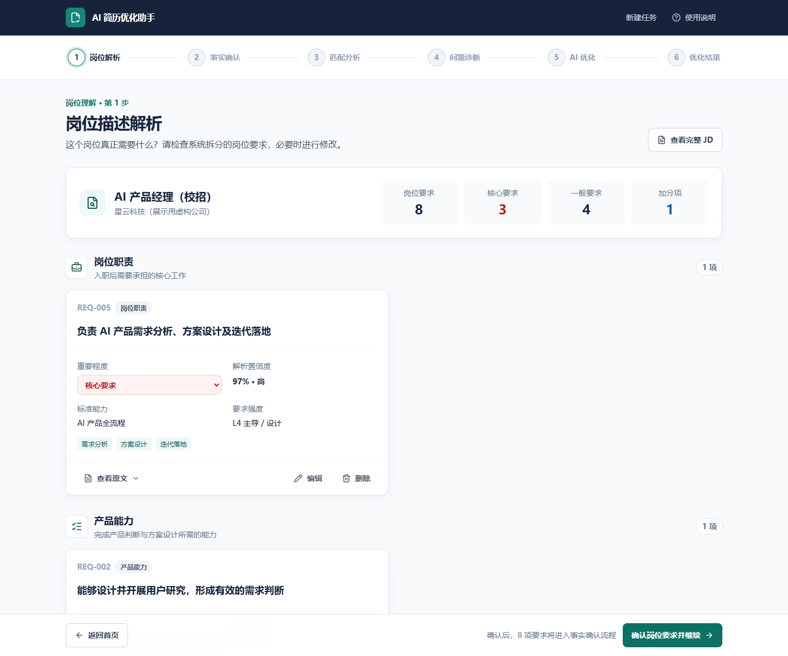
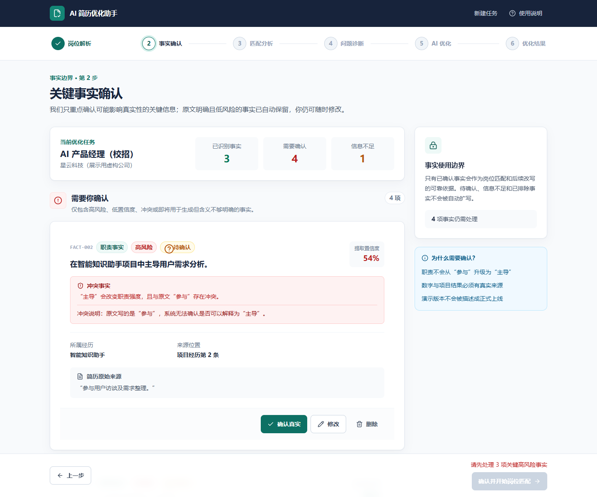
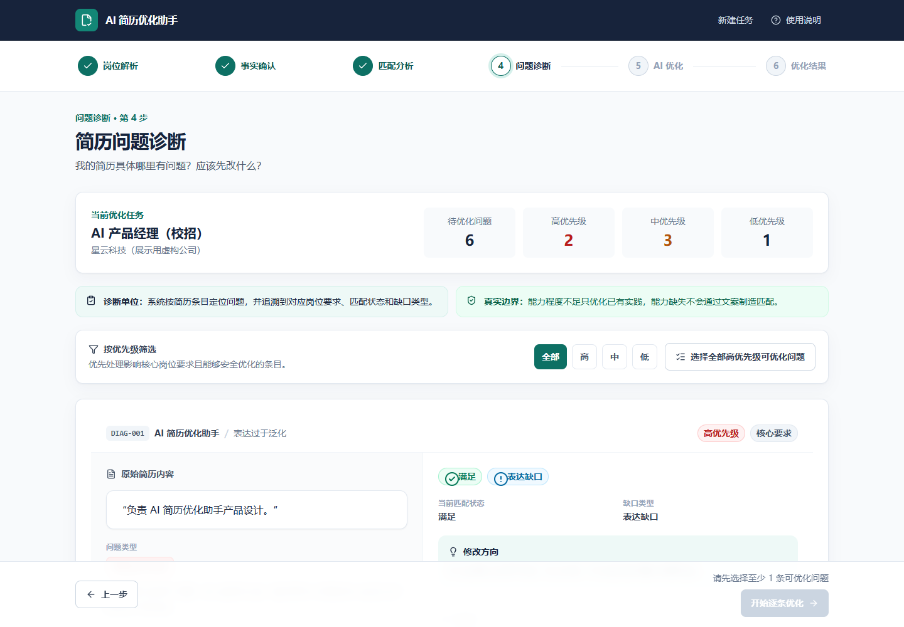
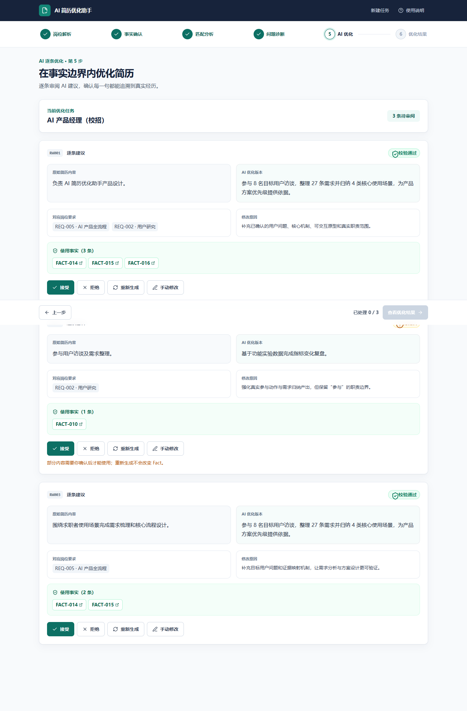
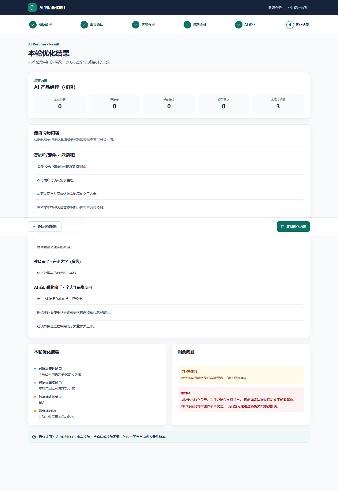

# AI 简历优化助手｜产品需求文档（PRD）

## 一、文档信息

### 1.1 基本信息

| 项目 | 内容 |
| --- | --- |
| 产品名称 | AI 简历优化助手 |
| 文档名称 | 11_产品需求文档_PRD.md |
| 文档类型 | 产品需求文档（Product Requirements Document，PRD） |
| 当前版本 | MVP V1 高保真原型 + 真实 JD / 简历 Fact / Evidence Mapping 模块 |
| 产品形态 | 桌面端优先的网页工具 |
| 当前实现 | React + TypeScript + Vite + Tailwind CSS；岗位描述结构化解析、简历 Fact 提取和 Evidence Mapping 已通过服务端代理接入真实 DeepSeek；最终 Match Status、Gap、Diagnosis、Rewrite 和事实校验仍使用 Mock 数据与确定性前端逻辑；状态保存在 sessionStorage |
| 核心对象 | 一份已有简历、一个具体目标岗位描述（JD）、一次优化任务 |
| 文档依据 | 01～10 产品文档、现有 7 页高保真原型、当前已联调代码 |

### 1.2 文档目的

本文档用于统一当前 MVP V1 的产品目标、范围、页面需求、数据对象、业务规则、异常处理和验收标准，作为后续产品评审、研发实现、测试验收和 AI 方案设计的共同依据。

本文档不展开具体提示词（Prompt）、JSON Schema、模型选型与模型调用策略，相关内容留待《12｜AI 方案设计》。

### 1.3 基准与优先级

需求判断按以下顺序执行：

1. 当前已联调通过的高保真原型和业务逻辑；
2. 《10产品原型设计.md》；
3. 09-1～09-6 机制文档；
4. 《08产品架构与核心流程.md》与《07MVP设计.md》；
5. 01～06 的立项、调研、场景、痛点、竞品和需求池资料。

当早期文档与当前实现存在差异时，本文采用当前已联调逻辑，并在“十五、文档与当前实现的一致性说明”中记录差异。

### 1.4 产品原则

- 真实性优先于表达效果；
- 诊断优先于生成；
- 证据优先于黑盒评分；
- 用户保留最终修改权；
- “没有写出来”不等于“没有做过”；
- “信息不足”不等于“能力缺失”；
- 能力缺口不能通过文案制造匹配；
- 可以由稳定规则完成的判断，不强制交给 AI。

## 二、产品背景与目标

### 2.1 产品背景

目标用户通常已经拥有一份基础简历，也已经找到具体岗位，但在针对岗位修改简历时仍面临以下连续问题：

- 无法从冗长、非结构化的 JD 中识别真正重要的岗位要求；
- 无法判断自己的真实经历能够证明哪些岗位能力；
- 知道简历“不够好”，但不能定位到具体条目和具体原因；
- 会使用通用 AI 润色，却难以控制职责扩大、数字虚构、技术新增和项目状态升级；
- 无法判断 AI 修改依据，也无法放心直接采用生成结果。

产品要解决的核心问题不是“怎样生成一份更漂亮的简历”，而是：

> 如何基于用户提供的真实经历和具体目标 JD，帮助用户理解岗位要求、判断匹配情况、定位简历问题，并完成真实、针对性、可解释、可控制的简历优化。

### 2.2 产品定位

AI 简历优化助手是一款面向校招、实习和初入职场求职者的 JD 驱动型简历诊断与优化工具，以岗位要求—证据映射（Requirement-Evidence Mapping）为核心，通过显式事实约束、缺口分类和可追溯改写，帮助用户在不创造经历的前提下完成针对性简历优化。

产品不是一站式求职平台，也不是以关键词数量或单一分数为核心的简历评分工具。

### 2.3 产品目标

MVP V1 需要完成以下目标：

1. 将非结构化 JD 转换为可检查、可修改、可追溯的岗位要求；
2. 从简历和用户补充信息中建立可确认的真实事实集合；
3. 为每项岗位要求建立真实事实证据关系，而不是仅做关键词匹配；
4. 分离匹配状态与缺口类型，解释“满足到什么程度”和“为什么存在差距”；
5. 以简历条目为单位输出问题诊断和修改方向；
6. 只允许可安全优化的内容进入 AI 逐条改写；
7. 对改写结果执行事实校验，并由用户接受、拒绝或手动修改；
8. 汇总最终采用的内容和仍无法通过简历修改解决的问题。

### 2.4 用户价值

- **针对性**：所有判断围绕当前目标岗位展开；
- **真实性**：改写只能使用可用事实，不能创造经历、职责、技能、数字或结果；
- **可解释性**：用户可以追溯岗位要求、真实事实、证据关系、缺口判断和修改依据；
- **可控性**：用户可以纠正解析结果、补充事实、删除错误映射，并决定是否采用每条改写。

### 2.5 MVP 成功标准

当前阶段不虚构商业数据、增长数据或真实上线结果。MVP 是否成立，以产品能力验证为主：

- 用户能够独立完成 7 页主流程；
- 用户能够理解每一步解决的问题；
- 重要判断能够追溯到原始 JD 或真实简历事实；
- 用户能够修改 Requirement、Fact 和 Evidence Mapping；
- 事实缺口能够通过补充或明确不存在转化为确定状态；
- 能力程度不足不会被改写为更高职责等级；
- 能力缺失不会进入普通改写流程；
- 只有通过事实校验并被用户接受或手动确认的内容进入最终结果。

## 三、目标用户与核心场景

### 3.1 核心用户

MVP V1 优先服务正在准备校招或实习投递的大学生和应届毕业生。典型特征包括：

- 已有一份基础简历；
- 已确定目标岗位或持有具体 JD；
- 有一定项目、课程、科研或实习经历；
- 求职经验有限，不熟悉招聘方的简历筛选逻辑；
- 有使用 AI 辅助求职的意愿；
- 希望提升岗位相关表达，但不接受虚构事实。

### 3.2 核心用户任务

当用户准备投递一个具体岗位时，希望快速知道：

1. 这个岗位真正需要什么；
2. 自己目前满足到什么程度；
3. 哪些真实经历能够证明这些能力；
4. 简历具体哪里有问题；
5. 哪些问题可以通过修改表达解决；
6. 如何在不改变事实的前提下完成针对性优化；
7. 最终哪些修改可以安全采用。

### 3.3 核心场景

| 场景 | 用户问题 | 产品响应 |
| --- | --- | --- |
| 理解岗位 | JD 很长，不知道哪些要求重要 | 拆分、分类并分级展示岗位要求 |
| 判断匹配 | 不知道自己是否具备岗位能力 | 建立 Requirement → Fact → Evidence Mapping |
| 区分未写与未做 | 简历没写，但可能实际做过 | 先标记事实缺口，再让用户补充或明确不存在 |
| 定位问题 | 知道简历需要改，但不知道改哪里 | 以简历条目为单位输出诊断与优先级 |
| 安全改写 | 希望 AI 优化，但担心乱编 | 使用事实白名单约束逐条改写并执行事实校验 |
| 用户决策 | 不确定是否应该接受 AI 文案 | 提供接受、拒绝、重新生成和手动修改 |

### 3.4 非目标用户与非核心场景

MVP V1 不面向完全没有基础简历、没有目标岗位且希望产品代替完成职业决策的用户，也不处理岗位推荐、自动投递、模拟面试、职业规划、Offer 比较和薪资分析等上下游场景。

## 四、产品范围与优先级

### 4.1 MVP V1 范围

MVP V1 只处理“一份已有简历 + 一个具体目标 JD”的单次诊断与优化任务，包含：

- 岗位名称、公司名称和完整 JD 输入；
- PDF 本地选择或粘贴简历文本；
- JD 结构化解析与 Requirement 用户纠错；
- 简历事实提取与风险驱动确认；
- 岗位要求—真实经历证据映射；
- 匹配状态判断与缺口分类；
- 基于简历条目的问题诊断；
- 优化列表选择；
- 事实约束下的逐条 AI 改写原型；
- 事实校验状态展示；
- 用户接受、拒绝、重新生成和手动修改；
- 最终采用内容、操作摘要和剩余问题展示；
- 复制最终文本。

当前岗位描述结构化解析、简历事实提取和岗位要求—证据映射已接入真实 DeepSeek：首页提交真实 JD 后生成 Requirement；事实确认页从粘贴简历文本生成 Fact；进入岗位匹配页后，以真实 Requirement 与当前可用 Fact 调用 `/api/evidence-mapping`，生成并校验 Evidence Mapping。最终 Match Status、Gap、Diagnosis、Rewrite 和事实校验仍使用 Mock 数据与确定性前端逻辑。

### 4.2 P1 增强范围

P1 在 MVP 核心机制稳定后考虑，包含：

- 基于稳定证据与缺口规则的匹配评分；
- 独立、完整的修改前后对比；
- 修改后重新评估；
- 历史版本与恢复；
- 一份基础简历对应多个 JD 的版本管理；
- 文本、PDF、DOCX 等结果导出。

匹配评分属于 P1，不进入 MVP V1 核心流程，也不在当前 7 页中展示综合匹配分。

### 4.3 P2 暂缓范围

- ATS 深度优化；
- 职位推荐；
- 自动投递；
- AI 模拟面试；
- 职业规划；
- Offer 比较；
- 薪资分析。

### 4.4 明确禁止的产品行为

- 不自动添加不存在的经历、职责、技能、技术、数字和项目结果；
- 不将“参与”改写为“主导”或“独立负责”；
- 不将原型、演示版本或内部测试改写为正式上线；
- 不将信息不足直接判定为能力缺失；
- 不用关键词命中直接替代证据判断；
- 不允许 AI 自动覆盖用户原文；
- 不通过文案消除真实能力缺口。

## 五、整体产品架构

### 5.1 功能模块

| 模块 | 核心职责 | 主要输出 |
| --- | --- | --- |
| 输入与解析 | 接收岗位和简历输入，建立结构化候选信息 | 优化任务、岗位要求、候选事实 |
| 事实管理 | 提取、分类、风险评估并确认真实事实 | 可用 Fact 集合及事实状态 |
| 岗位匹配 | 将岗位要求与真实事实建立证据关系 | Evidence Mapping、匹配状态 |
| 缺口判断 | 解释未完全满足的原因 | Gap、能力缺口子类型、后续动作 |
| 简历诊断 | 按简历条目定位问题 | Resume Diagnosis、优先级、修改方向 |
| AI 优化 | 在事实边界内生成逐条修改建议 | Rewrite Suggestion、事实依据 |
| 用户确认与结果 | 处理用户决策并组装最终内容 | 最终文本、操作摘要、剩余问题 |

### 5.2 核心价值链

`岗位描述 → 岗位要求 → 用户事实 → 证据映射 → 匹配状态 → 缺口类型 → 简历诊断 → 事实约束改写 → 事实校验 → 用户决策 → 最终结果`

### 5.3 当前原型数据流

- 首页输入保存到浏览器会话存储；
- Requirement、Fact、Evidence Mapping、Gap、优化列表和 Rewrite Suggestion 分别保存到浏览器会话存储；
- 返回已完成步骤或刷新当前标签页时，从浏览器会话存储恢复状态；
- 新建任务会清理本次流程的 Requirement、Fact、Mapping、Gap、优化选择、改写状态和步骤进度；
- 当前原型没有服务端数据库、账号体系、跨设备同步和长期任务存档；
- 关闭标签页或结束浏览器会话后，数据不保证继续保留。

## 六、整体业务流程与页面交互跳转

### 6.1 7 页主流程与返回路径

步骤导航允许返回已经到达的步骤；未完成步骤在导航中不可点击。当前前端原型未实现服务端路由鉴权，直接输入路由地址属于演示环境能力，不作为正常用户入口。

### 6.2 补充 Fact 后重新计算流程

当前 Mock 的“重新计算”是确定性的前端状态更新，不代表真实模型推理。修改既有 Fact 内容会被下游读取；删除已映射 Fact 时，系统移除 Mapping 中的 Fact 引用，若已无证据则回到“待确认 + 事实缺口”。

### 6.3 事实缺口分支

否定 Fact 只由具体岗位要求触发，不提前批量生成“未使用某技术”等否定事实。

### 6.4 AI 改写、事实校验与用户决策流程

## 七、7 个页面需求

### 7.1 首页 / 新建任务

| 项目 | 需求 |
| --- | --- |
| 页面目标 | 收集目标岗位和基础简历，建立一次优化任务的输入。 |
| 页面入口 | 根路径 `/` 或 `/task/new`；顶部“新建任务”入口。 |
| 前置条件 | 无。 |
| 页面输入 | 岗位名称、公司名称（选填）、完整岗位描述、PDF 简历或粘贴的简历文本。 |
| 核心内容 | 产品名称与价值说明、目标岗位模块、简历输入模块、真实性提示、“填入示例数据”和“开始分析”。 |
| 用户操作 | 填写岗位信息；选择 PDF；粘贴简历文本；移除或重新选择文件；填入演示数据；开始分析。 |
| 校验规则 | 岗位名称必填；JD 必填且当前原型要求去除首尾空格后不少于 80 个字符；PDF 与简历文本至少提供一种；条件不满足时主按钮禁用。 |
| 加载状态 | 显示“正在校验岗位描述 → 正在请求结构化解析 → 正在校验岗位要求 → 正在准备解析结果”；步骤用于解释当前真实 JD 解析过程，不代表模型精确进度。 |
| 页面出口 | 岗位描述解析页 `/task/:taskId/job-analysis`。 |
| 跳转条件 | 表单校验通过且用户点击“开始分析”。 |
| 返回路径 | 无；该页为流程起点。 |
| 跳转后系统动作 | 清理上一轮流程状态；保存本次文字输入；请求 `/api/jd-analysis`；只有通过服务端和客户端校验的 Requirement 才写入会话状态并进入岗位解析页。 |
| 异常状态 | 岗位名称为空、JD 为空或过短、未提供简历；真实模型未配置、网络失败、超时、返回非法 JSON、字段或枚举不合法、空结果、重复或过度拆分时保留输入并提示重试。文件选择区限制为 PDF，但本轮仍不执行真实简历解析。 |
| 验收标准 | 无效表单不能提交；示例数据可一次填入；真实 JD 解析成功后进入岗位解析页；失败时不写入伪造结果且输入保留。 |

### 7.2 岗位描述解析

| 项目 | 需求 |
| --- | --- |
| 页面目标 | 回答“这个岗位真正需要什么”，并让用户在匹配前纠正结构化岗位要求。 |
| 页面入口 | 首页分析完成后；已完成步骤导航。 |
| 前置条件 | 已建立当前优化任务并具有 JD 输入或演示 JD。 |
| 页面输入 | 当前任务、原始 JD、Requirement 集合。 |
| 核心内容 | 岗位名称与公司、要求总数、核心要求数、一般要求数、加分项数；按岗位职责、产品能力、AI 技术能力、专业技能、通用能力、背景要求、加分项分组。 |
| 单条内容 | 标准化岗位要求、重要程度、要求类型、能力标签、要求强度、原始 JD 来源、解析置信度；低于当前阈值的要求显示“建议检查”。 |
| 用户操作 | 查看完整 JD；展开单条原文；修改标准化要求、能力标签、类型、重要程度和要求强度；直接调整重要程度；删除错误要求。 |
| 删除规则 | 删除前二次确认；删除后从当前 Requirement 集合移除，后续页面仅处理仍存在的要求。 |
| 页面出口 | 关键事实确认页 `/task/:taskId/fact-confirmation`。 |
| 跳转条件 | 至少保留一条岗位要求并点击“确认岗位要求并继续”。 |
| 返回路径 | 首页 `/task/new`。 |
| 跳转后系统动作 | 将当前 Requirement 状态统一更新为“已确认”，写入会话存储，供事实确认和匹配分析使用。 |
| 异常状态 | 无 Requirement 时显示空状态且主按钮禁用；低置信度要求提示用户检查；错误 Requirement 可修改或删除。 |
| 验收标准 | 摘要数量与当前集合一致；编辑、重要程度调整和删除即时生效；刷新可恢复；确认后下游读取最新 Requirement。 |

### 7.3 关键事实确认

| 项目 | 需求 |
| --- | --- |
| 页面目标 | 通过风险驱动事实确认建立后续匹配和改写可安全使用的事实边界，而不是要求用户确认全部 Fact。 |
| 页面入口 | 岗位解析页确认后；已完成步骤导航。 |
| 前置条件 | 当前 Requirement 集合已确认；系统已有从用户粘贴的简历文本提取的候选 Fact。PDF 解析暂不在本阶段处理。 |
| 页面输入 | 当前任务与 Fact 集合。 |
| 核心内容 | 顶部展示已识别事实、需要确认、信息不足数量；页面分为“需要你确认、已识别事实、信息不足、已排除事实”。 |
| 风险驱动规则 | 高风险、低置信度、冲突事实、即将用于生成但原文不明确的事实进入“需要你确认”；原文明确、低风险且无冲突的事实可以直接进入“已识别事实”。 |
| 单条内容 | 事实内容、事实类型、所属经历、原始来源、风险等级、置信度、当前状态、风险原因；Fact ID 等次要信息可折叠查看。 |
| 用户操作 | 确认、修改、删除；项目状态类 Fact 编辑时使用：方案设计、原型、演示版本、最小可行产品、内部测试、正式上线。 |
| 删除规则 | 删除前二次确认；删除后状态变为“已删除”，进入“已排除事实”，不得用于匹配或改写。 |
| 页面出口 | 岗位匹配分析页 `/task/:taskId/matching`。 |
| 跳转条件 | 当前原型要求所有“待确认且需要确认”的 Fact 处理完成；页面同时区分待确认总数与其中的阻塞性关键事实数量。 |
| 返回路径 | 岗位描述解析页 `/task/:taskId/job-analysis`。 |
| 跳转后系统动作 | 事实提取接口返回通过校验的 Fact 后写入会话存储，页面展示真实候选事实；最新 Fact 集合供匹配页读取。 |
| 异常状态 | 简历文本过短、模型未配置、不可用、超时、非法 JSON、字段或枚举错误、空结果、重复事实或来源不可追溯时不写入伪造 Fact，保留输入并提示重试；有待确认 Fact 时主按钮禁用并展示数量。信息不足保留未知，不自动判定不存在；明确不存在和已删除 Fact 进入排除区。 |
| 验收标准 | 四个分区与状态一致；确认、修改、删除即时更新；待确认项全部处理后才能继续；下游不能使用已删除 Fact。 |

### 7.4 岗位匹配分析

| 项目 | 需求 |
| --- | --- |
| 页面目标 | 回答“这个岗位的每一项要求，我目前满足到什么程度，依据是什么”。 |
| 页面入口 | 事实确认完成后；已完成步骤导航。 |
| 前置条件 | Requirement 和可用 Fact 已存在；必要事实确认已完成。 |
| 页面输入 | Requirement、Fact、Evidence Mapping、Gap。 |
| 核心内容 | 当前任务；核心要求数；满足、部分满足、未满足、待确认数量；匹配状态与重要程度筛选；逐项 Requirement 卡片。 |
| 单条内容 | 岗位要求、重要程度、匹配状态、缺口类型、能力缺口子类型、支持证据、证据支持程度、判断说明、下一步操作；可展开查看所属经历、原始文本、Fact ID、相关性、证据等级和置信度。 |
| 判断路径 | Requirement → 真实 Fact → Evidence Mapping → 匹配状态 → Gap。关键词仅用于发现候选事实，不直接决定结论。 |
| 用户操作 | 筛选；查看证据；对事实缺口选择“我有相关经历、我没有相关经历、暂时跳过”；将表达缺口加入优化列表；删除错误 Mapping。 |
| 补充经历 | 用户填写所属经历、具体行动、本人职责和可选真实结果；提交后新增已确认 Fact，Mapping 更新为强支持和满足，Gap 更新为表达缺口。 |
| 明确不存在 | 新增按当前 Requirement 触发的“明确不存在”Fact；Mapping 更新为未满足与无有效支持；Gap 更新为能力缺口—能力缺失。 |
| Mapping 纠错 | 删除 Requirement 与指定 Fact 的关系，但不删除 Fact；若无剩余证据，则回到待确认 + 事实缺口。 |
| 页面出口 | 简历问题诊断页 `/task/:taskId/diagnosis`。 |
| 跳转条件 | 可直接继续；事实缺口不强制全部解决，但必须提示剩余数量和后续结果可能不完整。 |
| 返回路径 | 关键事实确认页 `/task/:taskId/fact-confirmation`。 |
| 跳转后系统动作 | 保存最新 Fact、Mapping、Gap 与匹配页优化选择；诊断页读取最新状态。 |
| 异常状态 | 筛选无结果时显示空状态；无有效 Fact 时显示无证据；用户移除全部 Mapping 后转为事实缺口；暂时跳过不改变状态。 |
| 验收标准 | 四种匹配状态与四种 Gap 类型只使用统一定义；补充/否定/跳过分支正确；删除 Mapping 不删除 Fact；允许带提示继续。 |

### 7.5 简历问题诊断

| 项目 | 需求 |
| --- | --- |
| 页面目标 | 回答“我的简历具体哪里有问题，应该先改什么”，并建立进入 AI 优化的条目列表。 |
| 页面入口 | 匹配分析页；已完成步骤导航。 |
| 前置条件 | 存在当前 Requirement、Mapping、Gap 与诊断数据。 |
| 页面输入 | Resume Diagnosis、Requirement、Evidence Mapping、Gap、Fact。 |
| 核心内容 | 当前任务；待优化问题总数；高、中、低优先级数量；优先级筛选；逐条诊断卡片。 |
| 诊断单位 | 以具体简历条目为主，不只给整份简历笼统评价。 |
| 单条内容 | 原始简历内容、问题类型、问题说明、对应岗位要求、当前匹配状态、缺口类型、修改优先级、修改方向和真实事实依据。 |
| 表达缺口操作 | 允许加入或移出优化列表。 |
| 能力程度不足操作 | 允许“优化真实表达”，但明确不能提升真实职责或能力等级。 |
| 能力缺失操作 | 明确提示无法通过简历修改解决，不提供加入优化列表按钮。 |
| 事实缺口操作 | 提示先补充真实信息，提供返回匹配页查看或补充事实的入口，不进入 AI 改写。 |
| 批量操作 | 可以选择或移出全部高优先级且可优化的问题；能力缺失和事实缺口不被加入。 |
| 页面出口 | AI 逐条优化页 `/task/:taskId/optimization`。 |
| 跳转条件 | 至少选择一条可优化诊断；未选择时主按钮禁用。 |
| 返回路径 | 岗位匹配分析页 `/task/:taskId/matching`。 |
| 跳转后系统动作 | 将诊断 ID 列表写入优化选择状态；AI 优化页按选择生成对应 Mock Rewrite Suggestion。 |
| 异常状态 | 筛选无结果时显示空状态；上游 Requirement 删除后不展示关联诊断；Gap 变化后自动移除不再可优化的选择。 |
| 验收标准 | 优先级筛选正确；三类主要缺口操作不同；能力缺失不能加入；选择状态可恢复；至少选择一条后才能继续。 |

### 7.6 AI 逐条优化

| 项目 | 需求 |
| --- | --- |
| 页面目标 | 在真实事实边界内逐条审阅改写建议，让每句话都能追溯到岗位要求和真实经历。 |
| 页面入口 | 诊断页点击“开始逐条优化”；已完成步骤导航。 |
| 前置条件 | 优化列表至少包含一条可优化诊断。 |
| 页面输入 | 已选 Diagnosis、对应 Requirement、Gap、Evidence Mapping、未删除 Fact，以及已有 Rewrite Suggestion 状态。 |
| 核心内容 | 当前任务、优化条目数量；每条建议的原文、优化版本、事实校验状态、用户决策；可展开查看岗位要求、修改原因和使用 Fact。 |
| 生成边界 | 只使用当前 Requirement、问题诊断、修改方向和可用 Fact；已删除 Fact 不进入使用事实；能力程度不足只能强化已有实践。 |
| 用户操作 | 接受、拒绝、重新生成、手动修改、查看 Fact 来源。 |
| 接受规则 | 事实校验为“校验不通过”时不能接受；校验通过后可标记为“已采纳”。 |
| 拒绝规则 | 标记为“已拒绝”，最终结果保留原文。 |
| 手动修改规则 | 用户编辑最终文本后，当前 Mock 标记为“已编辑 + 校验通过”，结果页采用编辑文本。 |
| 重新生成规则 | 在同一事实边界内生成另一种 Mock 表达，不改变 Requirement、Fact 或能力等级。 |
| 页面出口 | 优化结果页 `/task/:taskId/result`。 |
| 跳转条件 | 所有选中条目均已处理，且优化列表非空。 |
| 返回路径 | 简历问题诊断页 `/task/:taskId/diagnosis`。 |
| 跳转后系统动作 | 将每条 Rewrite Suggestion 的最终文本、校验状态和用户决策写入会话存储；结果页按决策组装最终内容。 |
| 异常状态 | 无优化条目或仍有待处理条目时主按钮禁用；校验不通过不能接受；使用 Fact 不存在时不展示来源。 |
| 验收标准 | 四种用户操作可用；决策返回后不丢失；接受、拒绝、手动修改分别驱动不同结果；条目全部处理后才能进入结果页。 |

### 7.7 优化结果

| 项目 | 需求 |
| --- | --- |
| 页面目标 | 汇总本轮最终采用内容、操作结果和仍需补充或提升的问题。 |
| 页面入口 | AI 优化页所有建议处理完成后；已完成步骤导航。 |
| 前置条件 | 存在优化选择和对应 Rewrite Suggestion 决策。 |
| 页面输入 | 原始简历、优化选择、Rewrite Suggestion、当前 Requirement、当前 Gap。 |
| 核心内容 | 当前岗位；本轮处理、已接受、手动修改、保留原文、未解决问题数量；最终简历内容；本轮优化摘要；剩余问题。 |
| 结果采用规则 | 仅“已采纳或已编辑”且“校验通过”的优化文本进入最终内容；已拒绝、待处理、待确认或校验不通过的条目保留原文。 |
| 剩余问题 | 展示仍待确认的信息与能力缺口；能力缺口明确说明无法通过文案修改解决。 |
| 用户操作 | 复制优化内容；返回 AI 优化页继续修改。 |
| 页面出口 | 返回 `/task/:taskId/optimization`；复制后仍停留在当前页。 |
| 跳转条件 | 返回操作无额外限制。 |
| 返回路径 | AI 逐条优化页。 |
| 跳转后系统动作 | 返回时继续读取会话中的改写决策；复制时将纯文本写入系统剪贴板。 |
| 异常状态 | 没有可采用改写时全部保留原文；剪贴板能力不可用时当前原型没有独立降级提示；当前版本不生成 PDF、DOCX 或本地结果文件。 |
| 验收标准 | 接受和手动修改采用最终文本；拒绝保留原文；统计与实际决策一致；复制内容与页面最终文本一致。 |

## 八、核心数据对象

### 8.1 优化任务（Resume Optimization Task）

| 字段 | 含义 |
| --- | --- |
| 任务 ID（taskId） | 当前任务唯一标识 |
| 岗位名称（jobTitle） | 目标岗位名称 |
| 公司名称（companyName） | 目标公司名称，可为空 |
| 原始岗位描述（rawJobDescription） | 用户输入的原始 JD |
| 当前步骤（currentStep） | 当前任务步骤 |
| 任务状态（taskStatus） | 当前任务处理状态 |
| 创建时间（createdAt） | 任务创建时间 |

当前代码中任务步骤类型覆盖任务内部 1～6 步，首页为任务创建入口，不计入任务内部步骤编号。

### 8.2 岗位要求（Job Requirement）

| 字段 | 含义 |
| --- | --- |
| Requirement ID | 岗位要求唯一标识 |
| 父 Requirement ID | 拆分前的父要求；当前 Mock 可为空 |
| 能力组 ID | 所属能力分组 |
| 原始文本与来源段落 | 追溯到原始 JD 的依据 |
| 标准化岗位要求 | 面向用户展示和后续匹配的原子化要求 |
| 要求类型 | 岗位职责、产品能力、AI 技术能力、专业技能、通用能力、背景要求、加分项 |
| 重要程度 | 核心要求、一般要求、加分项 |
| 能力标签 | Requirement 对应能力 |
| 关键词 | 候选发现信息，不直接决定匹配 |
| 是否显式要求 | 是否由 JD 明确提出 |
| 评价类型 | 当前要求的评价维度 |
| 要求强度 | L1 了解、L2 熟悉、L3 实践、L4 设计 / 主导 |
| 置信度 | 解析结果可信程度 |
| 状态 | 待确认、已修改或已确认等当前处理状态 |

### 8.3 事实（Fact）

| 字段 | 含义 |
| --- | --- |
| Fact ID | 事实唯一标识和追溯依据 |
| 经历 ID 与经历名称 | Fact 所属简历经历 |
| 事实内容 | 原子化、可确认的事实陈述 |
| 事实类型 | 当前实现包含背景事实、职责事实、行动事实、技术事实等 |
| 原始文本与来源位置 | 简历原文或用户补充来源 |
| 风险等级与风险原因 | 低、中、高及其判断依据 |
| 复核原因 | 冲突、低置信度或其他需要确认的原因，可为空 |
| 是否需要确认 | 是否进入显式确认流程 |
| 置信度 | 事实提取可信程度 |
| 状态 | 已确认、待确认、明确不存在、信息不足、已删除 |
| 项目状态 | 项目状态类 Fact 的可选字段 |
| 数字详情 | 数字值、单位和指标，按需存在 |
| 冲突说明与修改前内容 | 发生冲突或修改时的可选追溯信息 |

### 8.4 证据映射（Evidence Mapping）

| 字段 | 含义 |
| --- | --- |
| Mapping ID | 证据关系唯一标识 |
| Requirement ID | 被证明的岗位要求 |
| Fact ID 集合 | 支持该 Requirement 的真实事实 |
| 相关性 | Fact 与 Requirement 的语义相关程度 |
| 证据支持程度 | 强支持、部分支持、弱支持、无有效支持 |
| 证据等级 | 当前事实能够证明的能力层级 |
| 匹配状态 | 满足、部分满足、未满足、待确认 |
| 判断说明 | 为什么得到当前状态 |
| 置信度 | 当前 Mapping 判断的可信程度 |

### 8.5 缺口（Gap）

| 字段 | 含义 |
| --- | --- |
| Gap ID | 缺口唯一标识 |
| Requirement ID | 缺口对应的岗位要求 |
| 缺口类型 | 无缺口、表达缺口、事实缺口、能力缺口 |
| 能力缺口子类型 | 能力缺失、能力程度不足；非能力缺口时为空 |
| 缺口原因 | 当前缺口的解释 |
| 严重程度 | 高、中、低，与缺口类型分离 |
| 改写权限 | 可直接改写、确认后改写、不可改写、无需改写 |
| 下一步操作 | 用户或系统应采取的后续动作 |

### 8.6 简历诊断（Resume Diagnosis）

| 字段 | 含义 |
| --- | --- |
| Diagnosis ID | 诊断唯一标识 |
| 简历条目 ID | 被诊断的具体简历条目 |
| 经历 ID 与名称 | 条目所属经历 |
| 原始文本 | 当前简历内容 |
| 问题类型 | 如表达过于泛化、职责不清、关键行动缺失、事实风险等 |
| 问题说明 | 为什么该条目存在问题 |
| Requirement ID 集合 | 相关岗位要求 |
| 主 Requirement ID | 决定主要匹配与 Gap 操作的要求 |
| Fact ID 集合 | 诊断使用的事实依据 |
| 缺口类型 | 与上游 Gap 保持一致 |
| 优先级 | 高、中、低 |
| 修改方向 | 在事实边界内应该如何处理 |

### 8.7 改写建议（Rewrite Suggestion）

| 字段 | 含义 |
| --- | --- |
| Rewrite ID | 改写建议唯一标识 |
| Diagnosis ID | 来源诊断，可选关联字段 |
| 原始文本 | 改写前的简历条目 |
| 优化文本 | AI 建议或用户最终编辑文本 |
| Requirement ID 集合 | 本次改写对应的岗位要求 |
| 使用 Fact ID 集合 | 本次改写允许引用的事实 |
| 修改原因 | 改写依据与方向 |
| 事实校验状态 | 校验通过、待确认、校验不通过 |
| 用户决策 | 当前原型使用待处理、已采纳、已拒绝、已编辑 |

### 8.8 基础简历（Mock Resume）

当前原型中的基础简历包含简历 ID、用户名称、目标方向和经历集合；每段经历包含经历 ID、标题、组织、时间段和若干简历条目。该对象为当前 Mock 数据来源，不代表已经完成通用简历解析 Schema。

## 九、核心业务规则与状态定义

### 9.1 统一状态定义

| 状态类别 | 允许值 |
| --- | --- |
| 匹配状态 | 满足 / 部分满足 / 未满足 / 待确认 |
| 缺口类型 | 无缺口 / 表达缺口 / 事实缺口 / 能力缺口 |
| 能力缺口子类型 | 能力缺失 / 能力程度不足 |
| 事实状态 | 已确认 / 待确认 / 明确不存在 / 信息不足 / 已删除 |
| 事实校验状态 | 校验通过 / 待确认 / 校验不通过 |

状态必须同时展示文字，不得仅用颜色表达。

### 9.2 匹配状态与缺口类型分离

- 匹配状态回答“满足到什么程度”；
- 缺口类型回答“为什么没有完整满足或为什么需要修改”；
- “能力缺口”不是匹配状态；
- “满足 + 表达缺口”是合法组合，表示用户有真实证据，但简历呈现不足；
- “部分满足 + 能力缺口—能力程度不足”表示有相关实践，但不足以证明岗位要求的能力等级；
- “未满足 + 能力缺口—能力缺失”表示用户已明确没有相关经历；
- “待确认 + 事实缺口”表示当前信息不足，不能直接判断用户没有能力。

### 9.3 Fact 可用性规则

可作为匹配和改写依据的 Fact 包括：

- 用户已确认的事实；
- 原文明确、低风险、无冲突且当前状态为已确认的事实；
- 用户在事实缺口场景中主动补充并确认的事实。

不得使用：

- 已删除 Fact；
- 明确不存在 Fact 作为正向能力证据；
- 信息不足且尚未补充的 Fact 作为确定事实；
- 待确认的高风险或冲突 Fact 直接生成高风险表达。

### 9.4 风险驱动确认规则

- 不要求用户逐条确认全部 Fact；
- 职责等级、数字、用户数量、准确率、增长率、商业结果、项目状态等高风险信息优先确认；
- 低置信度、冲突、即将用于新增表达但原文不明确的 Fact 优先确认；
- 当前原型主按钮在所有显式待确认 Fact 处理前禁用；
- 阻塞性关键事实数量与待确认总数分别展示，避免数字误解。

### 9.5 Requirement 纠错规则

- 用户修改 Requirement 后，后续匹配使用修改后的当前状态；
- 用户调整重要程度后，摘要和后续严重程度判断使用新值；
- 用户删除 Requirement 后，下游不再展示关联 Mapping 和 Diagnosis；
- 删除 Requirement 不自动删除独立存在的 Fact。

### 9.6 Evidence Mapping 纠错规则

- 用户可以声明“该经历不能证明此要求”；
- 系统只删除指定 Requirement 与 Fact 的 Mapping 关系，不删除 Fact；
- 若仍有其他 Fact，保留剩余证据并降级证据说明；
- 若已无 Fact，Mapping 转为无有效支持、待确认，Gap 转为事实缺口。

### 9.7 事实缺口状态转换

| 用户操作 | Fact 变化 | Mapping 变化 | Gap 变化 |
| --- | --- | --- | --- |
| 我有相关经历 | 新增“已确认”Fact | 强支持、满足 | 表达缺口，可加入优化列表 |
| 我没有相关经历 | 新增“明确不存在”Fact | 无有效支持、未满足 | 能力缺口—能力缺失，不可改写 |
| 暂时跳过 | 不变 | 保持待确认 | 保持事实缺口，可带提示继续 |

### 9.8 改写权限规则

| Gap | 改写权限 | 产品行为 |
| --- | --- | --- |
| 无缺口 | 无需改写 | 保持现有表达或非优先处理 |
| 表达缺口 | 可直接改写 | 允许加入优化列表 |
| 事实缺口 | 确认后改写 | 先补充或确认事实，不能直接生成 |
| 能力缺口—能力程度不足 | 有限改写 | 可优化已有实践，不得提升职责等级 |
| 能力缺口—能力缺失 | 不可改写 | 展示真实差距，不提供普通 AI 改写入口 |

### 9.9 事实约束改写规则

- AI 允许优化措辞、调整顺序、强化岗位相关事实、合并重复信息、删除低价值信息和使用已确认数字；
- AI 不得添加不存在的技术、职责、数字、项目状态和结果；
- JD 中出现的技术不能反向写入简历，除非已有可用 Fact；
- 不同项目的 Fact 不得被拼接成同一段虚构经历；
- 没有真实数字时不强制量化；
- 重新生成只能改变表达，不能改变事实集合和能力等级；
- 每条生成结果必须保留 Requirement 与 Fact 追溯关系。

### 9.10 最终结果采用规则

- 已采纳 + 校验通过：采用优化文本；
- 已编辑 + 校验通过：采用用户最终编辑文本；
- 已拒绝：保留原文；
- 待处理、待确认或校验不通过：保留原文；
- 结果页统计必须由当前优化选择、用户决策、校验状态和能力 Gap 实时计算，不使用独立手填统计。

### 9.11 页面进度与持久化规则

- 用户通过正常流程到达某一步后，该步及之前步骤可从顶部导航返回；
- 未完成步骤在顶部导航中不可点击；
- 返回上一步不清空当前会话数据；
- 当前标签页刷新后从 sessionStorage 恢复 Requirement、Fact、Mapping、Gap、优化选择、改写状态和最远步骤；
- 新建任务重置上一轮工作流状态；
- 当前版本不提供跨标签页、跨浏览器或跨设备持久化保证。

## 十、AI、规则层与用户职责

### 10.1 AI 职责

AI 负责需要语义理解和生成的任务，其中 JD 理解与拆分已经真实接入，其余条目仍是后续目标：

- 理解并拆分非结构化 JD；
- 从简历原文中提取候选 Fact；
- 判断 Requirement 与 Fact 的语义相关性；
- 生成候选 Evidence Mapping 和解释；
- 识别简历条目的表达问题；
- 在明确的事实白名单和改写权限内生成优化文本；
- 对生成文本提出候选事实一致性判断。

当前“理解并拆分非结构化 JD”“从粘贴简历文本提取 Fact”和“岗位要求—证据映射”调用真实 DeepSeek；最终 Match Status、Gap、Diagnosis、Rewrite 和生成后事实校验仍由 Mock 数据和确定性前端逻辑模拟。

### 10.2 规则层职责

规则层负责稳定、可验证、需要强约束的任务：

- 表单完整性和页面跳转条件；
- 状态枚举与合法组合；
- Requirement、Fact、Mapping、Gap 的引用关系；
- 风险等级和是否需要显式确认的流程控制；
- 删除 Fact 后的 Mapping 清理；
- 表达缺口、事实缺口和能力缺口对应的改写权限；
- 能力缺失禁止进入优化列表；
- 校验不通过禁止接受；
- 最终文本采用与统计规则；
- 已完成步骤的返回权限。

### 10.3 用户职责

- 提供真实 JD 与简历内容；
- 核对并纠正 Requirement；
- 确认、修改、删除或补充 Fact；
- 判断一段经历是否能证明某项岗位要求；
- 对信息不足明确选择有经历、无经历或暂时跳过；
- 选择需要优化的简历条目；
- 接受、拒绝、重新生成或手动修改 AI 建议；
- 对最终用于投递的内容承担确认责任。

### 10.4 三方协作边界

AI 提供候选理解和候选表达，规则层限制状态和权限，用户纠正事实并做最终决策。任何一方都不能绕过已确认事实边界直接制造能力匹配。

## 十一、异常场景

### 11.1 输入异常

| 异常 | 当前处理 |
| --- | --- |
| 岗位名称为空 | 显示必填提示，禁用“开始分析” |
| JD 为空或少于 80 个字符 | 提示提供完整岗位职责和任职要求，禁用提交 |
| 未提供 PDF 或简历文本 | 禁用提交 |
| 非 PDF 文件 | 文件选择器限制为 PDF；当前 Mock 未实现独立 MIME 二次校验 |
| 文件超过 10 MB | 页面提示最大 10 MB；当前 Mock 未实现真实文件大小阻断与解析 |
| PDF 解析失败 | 当前 Mock 不执行 PDF 解析；真实解析失败处理留待后端与 AI 方案实现 |

### 11.2 解析异常

| 异常 | 产品处理 |
| --- | --- |
| JD 信息过少或高度模糊 | 首页阻止明显过短输入；低置信度 Requirement 显示“建议检查” |
| 模型服务未配置、不可用或超时 | 显示明确错误并允许保留原输入重试；不回退为 Mock 解析结果 |
| 模型返回非法 JSON、缺字段或非法枚举 | 服务端在配置的重试次数内请求修复；仍失败则拒绝整批写入 |
| Requirement 重复、原文不可追溯或已知过度拆分 | 服务端拒绝结果并重试；仍失败则展示解析失败 |
| Requirement 提取错误 | 用户可编辑或删除，删除前二次确认 |
| 无有效 Requirement | 展示空状态，不能进入下一步 |
| Fact 提取错误 | 用户可修改或删除；删除后不进入后续匹配 |
| Fact 冲突或风险高 | 进入“需要你确认”，在当前原型中处理前不能继续 |

### 11.3 匹配与缺口异常

| 异常 | 产品处理 |
| --- | --- |
| 无相关证据 | 保持待确认 + 事实缺口，提供三种用户分支 |
| 用户有经历但简历未写 | 新增已确认 Fact，转为满足 + 表达缺口 |
| 用户明确没有经历 | 新增明确不存在 Fact，转为未满足 + 能力缺口—能力缺失 |
| 用户认为 Mapping 错误 | 删除 Mapping 关系但保留 Fact |
| Fact 被删除且 Mapping 失去全部证据 | Mapping 转待确认，Gap 转事实缺口 |
| 仍有事实缺口 | 允许进入诊断，但展示结果可能不完整的提示 |

### 11.4 诊断与优化异常

| 异常 | 产品处理 |
| --- | --- |
| 没有选择可优化问题 | “开始逐条优化”禁用 |
| 能力缺失 | 不提供 AI 改写入口 |
| 能力程度不足 | 仅优化已有实践，并显示不得升级能力的提示 |
| 事实缺口 | 返回匹配页补充，不直接进入改写 |
| 改写校验不通过 | 禁止接受，不进入最终文本 |
| 改写待确认 | 不自动进入最终文本 |
| 用户拒绝 | 结果页保留原文 |
| 用户手动修改 | 保存最终编辑文本，当前 Mock 标记为已编辑且校验通过 |
| 无可用剪贴板能力 | 当前原型无独立降级提示，不影响页面结果展示 |

### 11.5 会话与恢复异常

- sessionStorage JSON 读取失败时，各页面回退到对应 Mock 数据或空状态；
- 刷新当前标签页不应白屏；
- 关闭会话后状态可能丢失，当前版本不承诺长期保存；
- 直接输入后续页面 URL 不属于正常入口，当前原型没有服务端路由守卫。

## 十二、非功能与交互要求

### 12.1 视觉与信息层级

- 全中文界面，必要专业名词使用中文（英文）；
- 保持简洁、专业、可信、工具型风格；
- 不使用大面积渐变、霓虹、游戏化、复杂动画或营销官网结构；
- 重要结论、状态、核心证据优先展示；
- Fact ID、置信度、来源和详细判断允许折叠，但不能删除；
- 主操作、次操作、危险操作和文本操作必须有明确视觉层级。

### 12.2 响应式要求

- 桌面端优先；
- 1440px、1280px 和常见 1024px 笔记本宽度正常展示；
- 窄屏自动改为单栏或压缩步骤标签；
- 页面不出现整体横向溢出；
- 固定底部操作区不能遮挡最后一段可操作内容。

### 12.3 状态反馈

- 加载、空状态、错误状态、操作成功反馈和弹窗使用统一组件；
- 删除 Requirement 或 Fact 必须二次确认；
- 状态变更后提供明确文字反馈；
- 所有状态标签保留文字，不能只依赖颜色；
- 主按钮禁用时提供可理解的原因或邻近提示。

### 12.4 可解释性要求

- Requirement 可以查看原始 JD；
- Fact 可以查看原始简历或用户补充来源；
- Mapping 可以查看支持 Fact 和判断说明；
- Diagnosis 可以查看对应 Requirement、Mapping 和 Fact；
- Rewrite 可以查看修改原因、Requirement 和使用 Fact；
- 结果页明确哪些文本已优化、手动修改或保留原文。

## 十三、验收标准

### 13.1 主流程验收

1. 用户能够从首页真实点击完成：首页 → 岗位解析 → 事实确认 → 匹配分析 → 问题诊断 → AI 优化 → 优化结果；
2. 每页上一步返回路径正确，返回后数据不丢失；
3. 已到达步骤可以从顶部导航返回，未完成步骤不能通过导航提前进入；
4. 页面刷新不白屏，sessionStorage 中的当前状态可以恢复；
5. 新建任务会清理上一轮流程状态。

### 13.2 核心动态场景验收

| 场景 | 预期结果 |
| --- | --- |
| 事实缺口 → 我有相关经历 | 新增已确认 Fact；更新 Mapping；变为满足 + 表达缺口；允许加入优化列表 |
| 事实缺口 → 我没有相关经历 | 新增明确不存在 Fact；变为未满足 + 能力缺口—能力缺失；禁止改写 |
| 表达缺口 → 加入优化列表 → 接受 | 结果页采用通过校验的优化文本 |
| AI 优化 → 拒绝 | 结果页保留原文 |
| AI 优化 → 手动修改 | 结果页采用最终编辑文本 |
| 删除错误 Mapping | 仅删除关系，不删除 Fact；无剩余证据时转为待确认 + 事实缺口 |
| 删除已映射 Fact | 下游移除该 Fact；无证据时 Mapping 与 Gap 正确回退 |

### 13.3 状态一致性验收

- 全项目只使用本 PRD 第 9.1 节规定的匹配状态、Gap 类型、能力缺口子类型、Fact 状态和事实校验状态；
- Diagnosis 展示的 Match Status 与 Gap Type 来自当前 Mapping 和 Gap，不使用相互冲突的独立状态；
- 能力缺失项不能进入优化列表；
- 能力程度不足项可以优化真实表达，但输出不能升级职责；
- 结果页采用逻辑与 Rewrite 决策、校验状态一致；
- 结果页统计与实际选中条目和用户操作一致。

### 13.4 页面验收

- 首页：无效输入不能提交，示例数据正常；真实 JD 解析加载、成功跳转和失败提示正常；
- 岗位解析：Requirement 可编辑、调整重要程度、查看来源和删除；
- 事实确认：四个分区正确，Fact 可确认、修改、删除；
- 匹配分析：筛选、证据展开、三种事实缺口操作和 Mapping 纠错正常；
- 问题诊断：优先级筛选、逐条选择、批量选择与缺口权限正确；
- AI 优化：接受、拒绝、重新生成、手动修改和 Fact 来源查看正常；
- 优化结果：最终内容、统计、剩余问题和复制文本正确。

### 13.5 技术与显示验收

- TypeScript 类型检查通过；
- 生产构建通过；
- 7 页在 1440px、1280px、1024px 与窄屏下无页面级横向溢出；
- 主要交互无控制台错误；
- 中文文案正常，无乱码；
- 不依赖运行时乱码替换；
- 当前 MVP 不出现综合匹配评分。

## 十四、版本规划

### 14.1 MVP V1：当前阶段

目标是验证完整价值闭环和关键机制，不追求生产级 AI 或商业化能力。当前交付包含 7 页高保真前端原型、真实 JD 结构化解析模块、其余模块的 Mock 状态流和可回归的核心交互。

### 14.2 P1：核心机制增强

在 Requirement、Fact、Evidence Mapping、Gap 和 Rewrite 的稳定性得到验证后，再逐步加入：

- 可解释匹配评分；
- 完整前后对比；
- 修改后重新评估；
- 历史版本；
- 多 JD 版本管理；
- 文本、PDF、DOCX 导出。

评分必须建立在证据和缺口之上，不能由大模型直接自由输出单一分数，也不能把分数解释为录取概率。

### 14.3 P2：扩展场景

P2 保持暂缓，不进入当前产品主线：ATS 深度优化、职位推荐、自动投递、AI 模拟面试、职业规划、Offer 比较和薪资分析。

### 14.4 后续 AI 方案设计边界

《12｜AI 方案设计》在不改变本 PRD 业务边界的前提下定义真实 AI 调用、结构化输出、事实校验、失败重试与 Evaluation 方案。岗位描述结构化解析已按该方案落地；后续模块仍按开发顺序逐步替换 Mock。

## 十五、文档与当前实现的一致性说明

### 15.1 已按当前实现统一的差异

1. **匹配状态名称**：早期文档出现“已匹配、部分匹配、未体现、能力缺口”等旧表达；当前统一采用“满足、部分满足、未满足、待确认”，能力缺口只作为 Gap Type。
2. **匹配评分**：早期方案中出现评分或重新评估设想；当前 MVP V1 不展示综合匹配分，评分明确归入 P1。
3. **事实确认阻塞条件**：机制文档强调高风险和关键事实优先确认；当前已联调代码在所有显式待确认 Fact 处理完成前禁用下一步，同时分别展示阻塞性关键事实数和待确认总数。本文按当前逻辑描述。
4. **结果导出**：需求池将正式简历导出放入 P1；当前结果页只支持复制纯文本，不生成 PDF、DOCX 或本地文件。
5. **解析与 AI 能力**：岗位描述结构化解析、粘贴简历文本的 Fact 提取和 Evidence Mapping 已通过 Vite 服务端代理接入真实 DeepSeek；PDF 解析、最终 Match Status、Gap 及后续 AI 模块尚未接入。
6. **首页输入与下游演示数据**：真实 JD、Requirement、简历文本、Fact 与 Evidence Mapping 已贯通；Match Status、Gap、Diagnosis、Rewrite 和事实校验仍主要使用固定 Mock 分析结果。
7. **加载时长**：四步加载文案用于解释真实 JD 解析阶段，实际完成时间由模型调用与校验耗时决定，不表示精确百分比。
8. **步骤访问**：正常 UI 仅允许跳转到当前或已完成步骤；当前纯前端原型没有直接 URL 的服务端鉴权或路由守卫。
9. **文件校验**：界面限制选择 PDF 并提示最大 10 MB，但当前 Mock 未执行独立 MIME、文件大小和解析结果校验。

### 15.2 当前实现边界而非新增需求

- 当前数据只保存在浏览器会话中；
- 当前任务 ID 为演示任务 ID；
- 当前 Requirement、Fact 和 Evidence Mapping 来自真实 AI；Match Status、Gap、Diagnosis、Rewrite 和事实校验仍来自 Mock 数据或确定性前端逻辑；PDF 文件仍不解析；
- 当前 `/api/jd-analysis`、`/api/resume-facts` 和 `/api/evidence-mapping` 由 Vite 插件提供，只适用于本地开发与 `vite preview`；正式部署必须迁移到独立后端或 Serverless，并继续保证 API Key 仅保存在服务端。本轮不实现生产部署；
- 当前手动修改后直接标记为“已编辑 + 校验通过”，真实产品中的再次校验留待 AI 方案实现；
- 当前重新生成通过前端 Mock 文案变化演示交互，不代表真实模型输出质量。

### 15.3 未定义项处理

现有资料足以定义当前 MVP V1 高保真原型，不存在阻塞本 PRD 的产品未定义项。以下内容已明确留到后续阶段，不需要在本文件中补充或假设：

- 真实 PDF 解析服务与失败重试细节；
- 模块二及后续真实 AI Prompt、JSON Schema 和模型选型；
- 账号、数据库、跨设备同步与长期任务保存；
- 生产级文件导出；
- P1 匹配评分的界面与上线阈值；
- 商业指标、真实用户量和线上效果数据。
